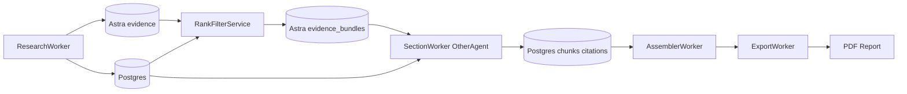

# Astra Evidence And Pipeline Handoff Plan

## Goal
Complete the MVP pipeline path toward a final report while the Section Writer is implemented by another agent. This plan focuses on the upstream and downstream dependencies that the Section Writer needs:

- Persist research evidence to Astra DB.
- Store raw evidence first, then rank/filter it per section when building context.
- Store citation-grade evidence references that Section Writer can cite.
- Wire pipeline continuation after `research_done` and after section completion.
- Avoid editing the Section Writer worker/service files unless coordination requires a small interface change.

## Current Reality
From `TEST_RUN_01.md`:

- Clarification, outline, and research run successfully.
- Postgres `sections` rows are created correctly.
- SSE outline payload had `section_id: null` because IDs were read before flush/commit.
- Research saved `sources` and `source_evidence` to Postgres.
- `ResearchService.save_to_astra()` is still a stub.
- Evidence quality is noisy, but enough for MVP if ranked/filtered.

The separate Section Writer plan already expects an Astra-first context bundle with Postgres fallback:

```136:147:C:\Users\hp\Desktop\VS\stratos\.cursor\plans\section-worker-plan_6d4a8939.plan.md
Build the section context from these sources:
- Report/session context: `Session.clarified_summary`, `Report.topic`, current `Section.title` and `Section.order_index`.
- Primary citation evidence from Astra:
  - `evidence`: full cleaned research text, snippets, source ids, urls, titles, domains, and metadata.
  - `trend_items`: curated news, papers, and social signals with summaries and source metadata.
  - `competitor_insights`: structured strengths, weaknesses, pricing, features, and `raw_evidence_ids`.
  - Future `evidence_bundles`: pre-ranked per-section evidence packs for Section Writer.
- Postgres metadata:
  - `Source`, `Trend`, `TrendItem`, `Competitor`, and `CompetitorFeature` rows for relational lookup, report scoping, and display metadata.
  - `SourceEvidence` as a current MVP fallback because `ResearchService.save_to_astra()` is still a stub.
```

## MVP Data Flow



## Design Decision: Store First, Rank Per Section

For MVP, use a hybrid but section-aware approach:

- Research Worker stores raw/cleaned evidence in Astra `evidence`.
- Research ingestion applies only basic cleanup filtering:
  - skip empty text
  - skip obvious boilerplate/auth/browser-check pages
  - skip duplicate URLs
- Do not assign one final global relevance score at ingestion time.
- Rank evidence later during section context building because the same source can be useful for different sections in different ways.
- Optionally cache the per-section ranked result in Astra `evidence_bundles`.

Example: one snippet about Upwork competition may rank:

- high for `Problem Context & Validation`
- high for `Existing Solutions`
- medium for `Competitor Landscape`
- low for `Technical Feasibility`

So final ranking should depend on `report_id + section_id + section_title`, not just the source URL.

Recommended score fields:

- `ingestion_quality_score`: generic cleanup/usefulness score stored on `evidence`
- `section_relevance_score`: stored only inside a per-section `evidence_bundles` item

## Implementation Scope For This Agent

### 1. Add Astra Repository Layer
Create `stratos-backend/app/services/astra_service.py`.

Responsibilities:

- Initialize Astra client from `ASTRA_DB_API_ENDPOINT` and `ASTRA_DB_APPLICATION_TOKEN`.
- Open collections:
  - `evidence`
  - optional MVP collection: `evidence_bundles`
- Provide functions:
  - `save_evidence_document(document: dict) -> str`
  - `list_evidence(report_id: str) -> list[dict]`
  - `save_evidence_bundle(bundle: dict) -> str`
  - `get_evidence_bundle(report_id: str, section_id: str) -> dict | None`

### 2. Implement `ResearchService.save_to_astra()`
Modify `stratos-backend/app/services/research_service.py`.

Current stub:

```298:311:C:\Users\hp\Desktop\VS\stratos\stratos-backend\app\services\research_service.py
def save_to_astra(
    self,
    report_id: str,
    source_id: str,
    url: str,
    text: str,
    metadata: dict,
):
    """
    TODO:
    - Insert into Astra 'evidence' collection
    - Include full cleaned text
    """
    pass
```

MVP document shape:

```python
{
    "evidence_id": str(uuid.uuid4()),
    "report_id": report_id,
    "source_id": source_id,
    "url": url,
    "title": metadata.get("title"),
    "domain": metadata.get("domain"),
    "type": metadata.get("type", "web"),
    "raw_text": text[:50000],
    "snippets": metadata.get("snippets", []),
    "metadata": metadata,
    "ingestion_quality_score": 0.0,
    "created_at": datetime.utcnow().isoformat(),
}
```

If Astra write fails, do not fail research for MVP. Log warning and keep Postgres fallback.

### 3. Add Lightweight Ranking And Filtering
Create `stratos-backend/app/services/evidence_ranker.py`.

MVP should be deterministic and cheap, not high-accuracy. Avoid LLM reranking for now.

This service should run during section context/bundle creation, not during raw research ingestion. Research ingestion may compute only a generic `ingestion_quality_score`; section ranking produces `section_relevance_score`.

Inputs:

- `clarified_summary`
- section title
- evidence document/snippet

Ranking signals:

- Positive keyword overlap with section title and clarified schema.
- Domain/type preference by section:
  - `Existing Solutions`, `Competitor Landscape`: prefer sources with competitor/platform/tool terms.
  - `Market & Industry Trends`: prefer news/trend/published sources.
  - `Technical Feasibility`: prefer API, integration, Python, LLM, Telegram, Discord, Reddit/X terms.
  - `Problem Context`, `Target Users`, `Opportunities`, `Risks`: prefer freelancer, Upwork, Fiverr, job board, client acquisition, pain point terms.
- Penalize boilerplate:
  - `sign in`, `checking your browser`, `javascript is disabled`, `free trial`, `no credit card`, `you signed in`, `oops`, `press enter`.
- Penalize off-topic terms for this MVP example:
  - crypto, dark web, unrelated cybersecurity, generic SEO unless section is about monitoring APIs.

Output per item:

```python
{
    "evidence_id": "...",
    "source_id": "...",
    "url": "...",
    "domain": "...",
    "snippet": "...",
    "section_relevance_score": 7.5,
    "reason": "Matched freelancer + high-ticket + Upwork terms",
}
```

### 4. Generate Per-Section Evidence Bundles After Research
Add a method in `orchestrator_service.py` or a small service `evidence_bundle_service.py`.

Trigger: after `research_done` and before dispatching Section Writer tasks.

Flow:

1. Load report, session, and sections from Postgres.
2. Read Astra evidence for `report_id`.
3. If Astra has no rows, fallback to Postgres `SourceEvidence`.
4. For each section, rank evidence and keep top 8-15 snippets.
5. Save an `evidence_bundle` document in Astra keyed by `report_id + section_id`.
6. Then dispatch Section Writer tasks.

Recommended MVP bundle shape:

```python
{
    "bundle_id": str(uuid.uuid4()),
    "report_id": report_id,
    "section_id": section_id,
    "section_title": section.title,
    "items": ranked_items[:12],
    "created_at": datetime.utcnow().isoformat(),
}
```

Note: `evidence_bundles` is an optional additional Astra collection. If the user does not want another collection, store these bundle documents in `evidence` with `type = "bundle"`, but a separate collection is cleaner.

### 5. Define Handoff Contract For Section Worker Agent
The other agent should consume either:

- Preferred: `AstraService.get_evidence_bundle(report_id, section_id)`
- Fallback: Postgres `SourceEvidence` if no Astra bundle exists

Context item contract:

```python
{
    "marker": "CIT-001",
    "evidence_id": "astra-evidence-id",
    "source_id": "postgres-source-id",
    "url": "https://...",
    "domain": "...",
    "quote": "snippet text",
    "section_relevance_score": 7.5,
}
```

This lets Section Writer persist Postgres `Citation` rows using `source_id` while still preserving the Astra evidence identity.

### 6. Pipeline Orchestration Boundaries
This agent can safely modify:

- `stratos-backend/app/services/astra_service.py`
- `stratos-backend/app/services/evidence_ranker.py`
- `stratos-backend/app/services/evidence_bundle_service.py`
- `stratos-backend/app/services/research_service.py`
- `stratos-backend/app/services/orchestrator_service.py`
- `stratos-backend/app/utils/redis_sub.py`
- `stratos-backend/app/workers/celery_app.py` only for imports after worker files exist

Avoid editing these if the other agent owns them:

- `stratos-backend/app/workers/section_worker.py`
- `stratos-backend/app/services/section_writer_service.py`
- `SECTION_WRITER_PROMPT` unless the other agent asks for the exact bundle contract.

### 7. Downstream MVP Completion
After Section Writer emits `section_done`, this agent can implement:

- Assembler Worker: assemble chunks into report draft.
- Export Worker: render simple PDF using `reportlab`.

These do not need Astra for MVP; they can read Postgres `sections`, `chunks`, `citations`, and `sources`.

## Acceptance Criteria

- Research Worker still completes even if Astra is unavailable.
- When Astra is available, `evidence` collection receives one document per useful web source.
- Raw Astra evidence is stored before section-specific ranking happens.
- Per-section ranked bundles are generated after `research_done`.
- Each bundle includes `source_id` and `evidence_id`, enabling Section Writer citations.
- Section Writer can run from `report_id + section_id` without doing its own evidence discovery.
- Once all sections emit `section_done`, assembler and export can produce a final PDF report.

## Minimal Test Plan

1. Run existing start-session → clarification → accept-consent flow.
2. Verify `research_done` SSE appears.
3. Check Astra `evidence` collection contains docs for the report.
4. Check Astra `evidence_bundles` contains one bundle per section.
5. Verify Section Writer receives ranked bundle with `CIT-001` style items.
6. After Section Writer completes, verify Postgres `chunks` and `citations` rows exist.
7. Verify `report_assembled` and `export_done` SSE events.
8. Confirm local PDF exists under `exports/<report_id>.pdf`.