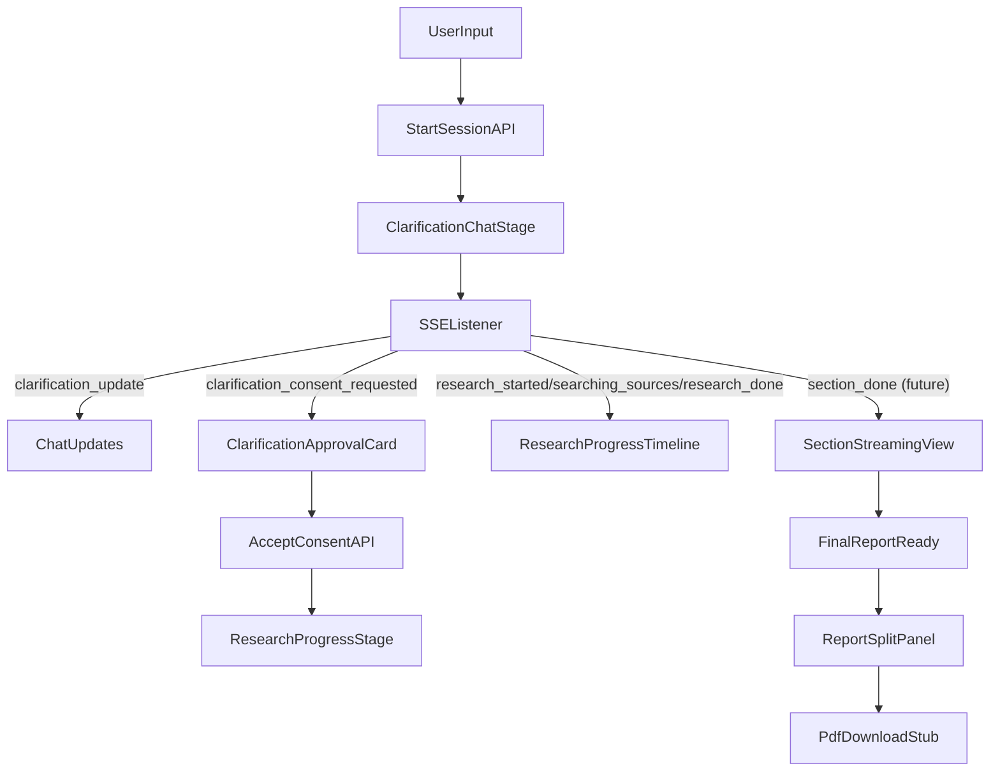

# Frontend Multi-Stage Chat UX Plan

## Goal
Implement a ChatGPT-like frontend flow in a new Next.js (App Router) app that integrates with existing backend runtime events and supports your 5-step UX journey:
1) Clarification chat interface
2) Approval summary box between clarification and research
3) Research progress visualization from SSE events
4) Progressive section response rendering
5) Split-screen final report view with PDF download action (stub-safe for now)

## Scope (UI-first MVP)
- Build full UI flow and state transitions.
- Integrate current backend endpoints/events that already exist.
- Add client-side stubs/fallbacks where backend stages are not yet implemented (section-writer/final export retrieval).
- Keep final report non-editable, but structure code for future editable mode.

## Files and Modules to Add
- `[C:/Users/hp/Desktop/VS/stratos/stratos-frontend/package.json](C:/Users/hp/Desktop/VS/stratos/stratos-frontend/package.json)`
- `[C:/Users/hp/Desktop/VS/stratos/stratos-frontend/next.config.ts](C:/Users/hp/Desktop/VS/stratos/stratos-frontend/next.config.ts)`
- `[C:/Users/hp/Desktop/VS/stratos/stratos-frontend/src/app/layout.tsx](C:/Users/hp/Desktop/VS/stratos/stratos-frontend/src/app/layout.tsx)`
- `[C:/Users/hp/Desktop/VS/stratos/stratos-frontend/src/app/page.tsx](C:/Users/hp/Desktop/VS/stratos/stratos-frontend/src/app/page.tsx)`
- `[C:/Users/hp/Desktop/VS/stratos/stratos-frontend/src/components/chat/ChatShell.tsx](C:/Users/hp/Desktop/VS/stratos/stratos-frontend/src/components/chat/ChatShell.tsx)`
- `[C:/Users/hp/Desktop/VS/stratos/stratos-frontend/src/components/chat/MessageList.tsx](C:/Users/hp/Desktop/VS/stratos/stratos-frontend/src/components/chat/MessageList.tsx)`
- `[C:/Users/hp/Desktop/VS/stratos/stratos-frontend/src/components/chat/Composer.tsx](C:/Users/hp/Desktop/VS/stratos/stratos-frontend/src/components/chat/Composer.tsx)`
- `[C:/Users/hp/Desktop/VS/stratos/stratos-frontend/src/components/stages/ClarificationApprovalCard.tsx](C:/Users/hp/Desktop/VS/stratos/stratos-frontend/src/components/stages/ClarificationApprovalCard.tsx)`
- `[C:/Users/hp/Desktop/VS/stratos/stratos-frontend/src/components/stages/ResearchProgressTimeline.tsx](C:/Users/hp/Desktop/VS/stratos/stratos-frontend/src/components/stages/ResearchProgressTimeline.tsx)`
- `[C:/Users/hp/Desktop/VS/stratos/stratos-frontend/src/components/report/ReportSplitPanel.tsx](C:/Users/hp/Desktop/VS/stratos/stratos-frontend/src/components/report/ReportSplitPanel.tsx)`
- `[C:/Users/hp/Desktop/VS/stratos/stratos-frontend/src/components/report/PdfDownloadButton.tsx](C:/Users/hp/Desktop/VS/stratos/stratos-frontend/src/components/report/PdfDownloadButton.tsx)`
- `[C:/Users/hp/Desktop/VS/stratos/stratos-frontend/src/lib/api/orchestratorClient.ts](C:/Users/hp/Desktop/VS/stratos/stratos-frontend/src/lib/api/orchestratorClient.ts)`
- `[C:/Users/hp/Desktop/VS/stratos/stratos-frontend/src/lib/sse/events.ts](C:/Users/hp/Desktop/VS/stratos/stratos-frontend/src/lib/sse/events.ts)`
- `[C:/Users/hp/Desktop/VS/stratos/stratos-frontend/src/lib/sse/useEventStream.ts](C:/Users/hp/Desktop/VS/stratos/stratos-frontend/src/lib/sse/useEventStream.ts)`
- `[C:/Users/hp/Desktop/VS/stratos/stratos-frontend/src/lib/state/chatFlowStore.ts](C:/Users/hp/Desktop/VS/stratos/stratos-frontend/src/lib/state/chatFlowStore.ts)`
- `[C:/Users/hp/Desktop/VS/stratos/stratos-frontend/.env.example](C:/Users/hp/Desktop/VS/stratos/stratos-frontend/.env.example)`

## Backend Contracts to Consume (Existing)
- `[C:/Users/hp/Desktop/VS/stratos/stratos-backend/app/api/sse.py](C:/Users/hp/Desktop/VS/stratos/stratos-backend/app/api/sse.py)` via `GET /stream/events`
- `[C:/Users/hp/Desktop/VS/stratos/stratos-backend/app/api/orchestrator.py](C:/Users/hp/Desktop/VS/stratos/stratos-backend/app/api/orchestrator.py)`
  - `POST /orchestrate/orchestrate/start-session`
  - `POST /orchestrate/orchestrate/clarification/chat`
  - `POST /orchestrate/orchestrate/clarification/accept-consent`
  - `GET /orchestrate/orchestrate/status/{session_id}`

## UI Flow Architecture

## Stage-by-Stage Implementation

### 1) Clarification Chat (ChatGPT-style)
- Build left/main conversation layout with:
  - scrollable message list
  - user/assistant message bubbles
  - sticky composer at bottom
- On first prompt:
  - call `start-session`
  - persist `sessionId` in store
  - render follow-up assistant prompts from `clarification_update.next_question`
- Map clarification payload fields into compact assistant messages + optional collapsible metadata chips (confidence, constraints).

### 2) Clarification Approval Summary Card
- When SSE event `clarification_consent_requested` arrives:
  - freeze normal clarification input
  - render centered approval card similar to Gemini “Start research” UX
  - show summary text and two actions: `Edit Clarification` and `Start Research`
- `Start Research` triggers `accept-consent` API; move stage to research progress.

### 3) Research Progress / Thinking Path
- Implement event timeline component fed by SSE events:
  - `research_started`
  - `searching_sources`
  - `research_done`
  - `research_failed`
- Show chronological progress rows with status icons and timestamps.
- Add deterministic reconnect + de-dup logic in SSE hook for robust UX.

### 4) Section Streaming as Available
- Add store shape now for section-level progressive rendering:
  - `sectionsById`, `sectionOrder`, `partialText`, `status`
- For MVP, support two modes:
  - live mode: consume future `section_done` events when backend emits them
  - fallback mode: if no section events, show placeholder “compiling sections...” stream panel
- Keep rendering pipeline ready so backend section events can plug in without UI rewrite.

### 5) Final Report Split-Screen + PDF Control
- Introduce split layout:
  - left: chat/progress history
  - right: read-only report viewer panel
- Add top-right PDF download button:
  - for now invoke a stub handler with toast: “PDF export not yet enabled”
  - route this through a dedicated client method placeholder for later backend endpoint
- Keep report read-only with clear component boundaries to enable future edit mode.

## State Model (Frontend)
- `stage`: `clarifying | awaitingConsent | researching | streamingSections | reportReady | failed`
- `sessionId`, `reportId`
- `messages[]`
- `progressEvents[]`
- `sections{}`
- `finalReport`
- `connectionStatus`

## Integration and Reliability Rules
- Parse SSE as `{ type, payload }` only (matching backend publisher contract).
- Ignore unknown events safely; log to dev console.
- Recover session on refresh using `status/{session_id}` endpoint.
- Show non-blocking retry UI on SSE disconnect.

## Design Parity Notes (Your Reference Images)
- Clarification phase mirrors classic chat UI density and alignment.
- Consent phase uses a prominent summary action card with single primary CTA.
- Research phase uses compact staged progress list (“thinking path”) rather than raw logs.
- Final phase opens report in side panel with persistent download affordance.

## Testing Plan
- Manual E2E:
  - start clarification, send multi-turn chat
  - receive consent card and approve
  - observe research progress timeline
  - verify fallback behavior before section events are available
  - verify split panel + PDF stub behavior
- Unit-level:
  - SSE event parser/reducer tests
  - stage transition reducer tests
  - component rendering tests for approval/progress/report panels

## Future-ready Hooks (Not in this MVP)
- report edit mode toggle
- inline citation expansion in report panel
- real export endpoint wiring
- deep-dive follow-up chat on completed report