# MVP Pipeline Completion Plan

## Current pipeline state

```mermaid
flowchart LR
    clarification[Clarification Worker]
    outline[Outline Worker]
    research[Research Worker]
    section[Section Writer]
    assembler[Assembler Worker]
    export[Export Worker]

    clarification -->|"clarification_completed"| outline
    outline -->|"outline_ready (section_id=null in payload only)"| research
    research -->|"research_done (no handler)"| section
    section -->|"section_done (missing)"| assembler
    assembler -->|"report_assembled (missing)"| export
```



- Everything left of the dotted break works today.
- `section_id = null` blocks section writer from knowing which section to write.
- `research_done` has no handler in `redis_sub.py` so the pipeline stops there.
- Section writer, assembler, export workers do not exist.

---

## Fix 1 — Outline Worker: populate section_id in SSE payload

**File:** [`stratos-backend/app/workers/outline_worker.py`](stratos-backend/app/workers/outline_worker.py)

**Clarification:** Sections ARE saved to DB correctly with valid UUIDs (confirmed via `select * from sections`). The bug is only in the in-memory `sections` list that is built before `db.commit()`. SQLAlchemy assigns the UUID during INSERT (at flush/commit), so `section.id` is `None` on the Python object when `sections.append(...)` runs.

Fix: generate UUID explicitly before model creation so it is available immediately:

```python
import uuid
...
section_id = str(uuid.uuid4())
section = models.Section(
    id=section_id,
    report_id=report_id,
    title=title,
    order_index=idx,
)
db.add(section)
sections.append({"section_id": section_id, "title": title, "order_index": idx})

db.commit()
```

Also add `status` column to `Section` model in [`stratos-backend/app/db/models.py`](stratos-backend/app/db/models.py) to track per-section completion:
```python
status = Column(String, default="pending")
```
Re-run `python scripts/create_tables.py` to apply (adds column to existing table).

---

## Fix 2 — Section Writer Worker (new file)

**New files:**
- `stratos-backend/app/workers/section_worker.py`
- `stratos-backend/app/services/section_writer_service.py`

For MVP: reads evidence from **Postgres** `source_evidence` (not Astra — save_to_astra is still a stub). This is sufficient for pipeline completion.

Flow:
1. Load section + parent report + session clarified_summary
2. Fetch top-N snippets from `source_evidence` via `sources.report_id`
3. Call LLM with evidence bundle + section title + clarified summary
4. Parse response into chunks
5. Save to `chunks` table
6. Emit `section_done` with `section_id` + `report_id`

---

## Fix 3 — Assembler Worker (new file)

**New file:** `stratos-backend/app/workers/assembler_worker.py`

Flow:
1. Load all sections for `report_id` ordered by `order_index`
2. Load all chunks per section ordered by `chunk_index`
3. Assemble into `{ sections: [{ title, chunks: [text...] }] }`
4. Save assembled JSON to `reports.topic` field (or a new `draft` text column — simplest for MVP)
5. Update `report.status = READY_FOR_EXPORT`
6. Emit `report_assembled`

---

## Fix 4 — Export Worker (new file)

**New file:** `stratos-backend/app/workers/export_worker.py`

Uses `reportlab` (already in `requirements.txt`).

Flow:
1. Load assembled report from DB
2. Render PDF: title page + section headers + chunk text per section
3. Save to local path: `exports/<report_id>.pdf`
4. Persist row in `exports` table
5. Emit `export_done` with file path

---

## Fix 5 — Orchestrator + redis_sub wiring

**File:** [`stratos-backend/app/utils/redis_sub.py`](stratos-backend/app/utils/redis_sub.py)

Add handlers for 3 new events:

```python
elif event_type == "research_done":
    # fan-out: one section_writer task per section
    OrchestratorService.handle_research_done(db, payload["report_id"])

elif event_type == "section_done":
    OrchestratorService.handle_section_done(db, payload["report_id"], payload["section_id"])

elif event_type == "report_assembled":
    OrchestratorService.handle_assembly_done(db, payload["report_id"])
```

**File:** [`stratos-backend/app/services/orchestrator_service.py`](stratos-backend/app/services/orchestrator_service.py)

Add 3 new methods:
- `handle_research_done` — fetch all section IDs from DB, dispatch `run_section_writer.delay(section_id)` for each
- `handle_section_done` — mark section `status=done`, check if all sections complete, if yes dispatch `run_assembler.delay(report_id)`
- `handle_assembly_done` — dispatch `run_export.delay(report_id)`, update session to `READY_FOR_EXPORT`

---

## Fix 6 — Register new workers in celery_app

**File:** [`stratos-backend/app/workers/celery_app.py`](stratos-backend/app/workers/celery_app.py)

Replace stub imports with real ones once workers exist:
```python
import app.workers.section_worker
import app.workers.assembler_worker
import app.workers.export_worker
```
Comment out `trend_worker`, `competitor_worker`, `embedding_worker` (still not built) to prevent startup errors.

---

## Target SSE event flow after fixes

```
session_created → clarification_started → clarification_update(s)
→ clarification_ready → clarification_consent_requested
→ clarification_completed → outline_ready (with valid section_ids)
→ outline_accepted → research_started → searching_sources → research_done
→ section_writing_started → section_done (x8, parallel)
→ report_assembled → export_done
```

---

## Files to create / modify

- Modify: `app/workers/outline_worker.py`
- Modify: `app/db/models.py` (add `status` to Section)
- Modify: `app/utils/redis_sub.py`
- Modify: `app/services/orchestrator_service.py`
- Modify: `app/workers/celery_app.py`
- Create: `app/workers/section_worker.py`
- Create: `app/services/section_writer_service.py`
- Create: `app/workers/assembler_worker.py`
- Create: `app/workers/export_worker.py`
