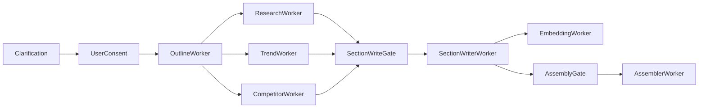

# Section Writer Worker Plan

## Scope
Build the Section Writer Worker as a per-section Celery task that generates grounded section drafts from the finalized outline and available evidence, pulls citation-grade evidence primarily from Astra DB, persists ordered chunks and citation mappings, emits streaming progress events, and hands persisted chunks to the embedding stage.

Primary references:
- [stratos-backend/Docs/System Design Brief.md](stratos-backend/Docs/System%20Design%20Brief.md): places Section Writer after research/trend/competitor and before embedding/assembly.
- [stratos-backend/Docs/API Contracts/Section Writer Worker.md](stratos-backend/Docs/API%20Contracts/Section%20Writer%20Worker.md): defines `run_section_writer(report_id, section_id)`, `section_done`, and `section_failed`.
- [stratos-backend/Docs/DB Schema.md](stratos-backend/Docs/DB%20Schema.md): defines Postgres metadata tables plus Astra evidence/vector collections.
- [stratos-backend/app/db/models.py](stratos-backend/app/db/models.py): current SQLAlchemy models already include `Section`, `Chunk`, `Citation`, `Source`, `SourceEvidence`, `TrendItem`, and `CompetitorFeature`.

## Pipeline Placement
Target flow:



For MVP implementation, support two evidence modes:
- Full target mode: section writing waits for `research_done`, `trend_ready`, and `competitor_done`, then builds a `context_bundle` from Astra evidence/citation collections plus Postgres metadata.
- Current backend mode: section writing can run after `research_done` using `Source` and `SourceEvidence`, while preserving placeholders for Astra evidence reads until Astra persistence is wired.

## Responsibilities
The Section Writer Worker should:
- Load and validate `report_id`, `section_id`, report/session context, and the section title/order.
- Build a bounded `context_bundle` with Astra evidence/citation records and Postgres source/trend/competitor metadata relevant to the section.
- Ensure the generated content directly matches the section title and does not drift into another outline section's scope.
- Generate section content using an LLM prompt that only allows facts from the supplied evidence blocks.
- Produce ordered chunks, not one giant section blob, so the frontend can stream progress and the embedding worker can process atomic units.
- Extract inline citation markers from each chunk and persist Postgres `Citation` rows linking chunks to known `Source` metadata, while preserving Astra evidence ids as the citation source of truth.
- Emit `section_started`, `section_chunk`, `section_done`, and `section_failed` events.
- Enqueue `run_embedding(report_id, chunk_ids)` once chunks are saved, or leave a documented hook if the embedding worker is not implemented yet.

It should not:
- Discover new evidence itself except through an explicit fallback/remediation path.
- Rewrite the entire report; that belongs to Assembler.
- Invent citation sources or cite evidence not present in the bundle.
- Handle editorial approval or style presets in the MVP.

## Functional Design
Add a worker module and service layer following existing local patterns:
- `stratos-backend/app/workers/section_worker.py`
- `stratos-backend/app/services/section_writer_service.py`
- New prompt constant in `stratos-backend/app/llm/prompts.py`, for example `SECTION_WRITER_PROMPT`.

The service methods should mirror the existing contract:
- `run_section_writer(report_id: str, section_id: str) -> None`
- `build_section_context(report_id: str, section_id: str) -> dict`
- `generate_section_draft(context: dict) -> dict`
- `persist_section_chunks(report_id: str, section_id: str, chunks: list[dict]) -> list[str]`
- `validate_section_draft(draft: dict, context: dict) -> None`

Expected LLM output should be strict JSON first, even if the UI later streams saved chunks:

```json
{
  "chunks": [
    {
      "chunk_index": 1,
      "text": "... [CIT-001] ...",
      "citations": [
        {"marker": "CIT-001", "source_id": "uuid", "quote": "supporting snippet"}
      ]
    }
  ]
}
```

This is simpler and safer than trusting arbitrary streaming text for MVP validation. If true token streaming is added later, keep the same persistence contract and stream only after each chunk passes validation.

## Section Title Alignment
The worker must treat the section title as the main writing contract. Every generated chunk should answer the current section heading, not just use any available evidence.

Add title alignment in three places:
- Context selection: choose evidence based on the `Section.title` and suppress evidence that clearly belongs to other sections unless it is needed as supporting context.
- Prompt contract: include the section title, the neighboring outline titles, and an instruction to stay within the current section's scope.
- Validation: require the LLM output to include a short `section_alignment_summary` explaining how the chunk set satisfies the title, then reject or repair output that drifts.

Updated expected LLM output:

```json
{
  "section_alignment_summary": "This section explains the competitor landscape by comparing existing tools, positioning, and gaps.",
  "chunks": [
    {
      "chunk_index": 1,
      "text": "... [CIT-001] ...",
      "citations": [
        {"marker": "CIT-001", "source_id": "uuid", "quote": "supporting snippet"}
      ]
    }
  ]
}
```

Validation can start with deterministic checks for MVP:
- The output must mention or clearly address the key terms implied by the title.
- The generated section must not primarily discuss another core title, such as writing market trends under `Competitor Landscape`.
- If the section title is `Risks & Open Questions`, the chunks should be framed around risks, unknowns, constraints, or unanswered validation points.
- If title alignment is weak, retry once with a repair prompt before emitting `section_failed`.

## Context Bundle
Build the section context from these sources:
- Report/session context: `Session.clarified_summary`, `Report.topic`, current `Section.title` and `Section.order_index`.
- Primary citation evidence from Astra:
  - `evidence`: full cleaned research text, snippets, source ids, urls, titles, domains, and metadata.
  - `trend_items`: curated news, papers, and social signals with summaries and source metadata.
  - `competitor_insights`: structured strengths, weaknesses, pricing, features, and `raw_evidence_ids`.
  - Future `evidence_bundles`: pre-ranked per-section evidence packs for Section Writer.
- Postgres metadata:
  - `Source`, `Trend`, `TrendItem`, `Competitor`, and `CompetitorFeature` rows for relational lookup, report scoping, and display metadata.
  - `SourceEvidence` as a current MVP fallback because `ResearchService.save_to_astra()` is still a stub.

Selection rule for MVP:
- Use section-title heuristics to prioritize evidence categories: competitor sections prefer competitors and product/source evidence, market trend sections prefer trend/news sources, problem/persona/opportunity/risk sections prefer research snippets.
- Cap the prompt context to a small deterministic bundle, for example 8 to 15 evidence items total.
- Assign stable markers like `CIT-001` before prompting and require the LLM to use only those markers.

Astra read placeholders for implementation:

```python
def fetch_astra_evidence(report_id: str, section_title: str) -> list[dict]:
    \"\"\"Return citation-grade evidence rows from Astra `evidence`. Stub until Astra client is wired.\"\"\"
    return []

def fetch_astra_trend_items(report_id: str, section_title: str) -> list[dict]:
    \"\"\"Return section-relevant trend evidence from Astra `trend_items`. Stub until Trend Worker lands.\"\"\"
    return []

def fetch_astra_competitor_insights(report_id: str, section_title: str) -> list[dict]:
    \"\"\"Return section-relevant competitor evidence from Astra `competitor_insights`. Stub until Competitor Worker lands.\"\"\"
    return []

def build_citation_marker_map(astra_items: list[dict], postgres_sources: list[dict]) -> dict:
    \"\"\"Create stable CIT markers that carry both Astra evidence ids and Postgres source ids.\"\"\"
    return {}
```

Preferred citation model:
- Astra DB should be the source of truth for citation-grade evidence because it stores the actual unstructured text, snippets, raw evidence ids, and vector-searchable context.
- Postgres should store citation metadata and relational links: `chunk_id`, `source_id`, `citation_marker`, `quote`, and ideally an `astra_evidence_id` or equivalent once the schema is extended.
- The Section Writer should cite only evidence selected from Astra in the target architecture, then persist a compact citation record in Postgres so assembler/export/deep-dive flows can resolve citations quickly.

## Dependencies
Runtime dependencies:
- Celery and Redis broker via existing `celery_app`.
- SQLAlchemy session via `SessionLocal`.
- Astra DB client/repository for `evidence`, `trend_items`, `competitor_insights`, and future `evidence_bundles` reads.
- LLM client via `generate_chat` in `stratos-backend/app/llm/client.py`.
- Redis Pub/Sub via `publish_event`.
- Current Postgres models in `stratos-backend/app/db/models.py`.

Pipeline dependencies:
- Required: outline sections exist for the report.
- Required for current MVP: `research_done` has persisted at least one usable `SourceEvidence` snippet, unless degraded mode is explicitly accepted.
- Future required: `trend_ready` and `competitor_done` when those workers become live.
- Downstream: embedding worker receives persisted chunk ids; assembler waits until all required sections emit `section_done`.

Schema/index dependencies to review before implementation:
- Add or verify deterministic uniqueness for chunks: one row per `(section_id, chunk_index)`.
- Add or verify citation integrity: citation `source_id` must belong to the same report as the section.
- Extend Postgres `Citation` later with `astra_evidence_id` or `evidence_ref` so each persisted citation can point back to the exact Astra evidence record used by the LLM.
- Consider adding section status fields later (`pending`, `writing`, `done`, `failed`) because current `Section` only has `id`, `report_id`, `title`, and `order_index`.

## Event Contract
Emit these events:
- `section_started`: `{report_id, section_id}`
- `section_chunk`: `{report_id, section_id, chunk_id, chunk_index, text, citations}`
- `section_done`: `{report_id, section_id, chunk_count}`
- `section_failed`: `{report_id, section_id, error}`

Report-level orchestration should track completion count and only enter assembly/export readiness after all sections complete.

## Expected Outputs
Persistent outputs:
- `chunks`: ordered rows with `section_id`, `chunk_text`, and `chunk_index`.
- `citations`: one or more rows per chunk with `chunk_id`, `source_id`, `citation_marker`, supporting `quote`, and later an Astra evidence reference.
- Optional/future Astra writes: extended citation metadata, evidence links, and per-section evidence bundle usage logs.

User-facing outputs:
- Realtime section chunk events that the frontend can render progressively.
- Section completion event with deterministic chunk count.
- A recoverable failure event when evidence is missing or LLM output fails validation.

Downstream outputs:
- A list of chunk ids for embedding.
- Completed section/chunk/citation data for assembler.

## Validation And Failure Handling
Validation should reject generated output when:
- JSON is invalid or missing `chunks`.
- Chunks are empty or too large.
- `section_alignment_summary` is missing or does not match the current `Section.title`.
- The content is mostly about a different outline section than the requested `section_id`.
- A citation marker appears that was not assigned in the prompt context.
- A citation references an Astra evidence id or Postgres `source_id` not in the context bundle.
- A section has factual claims but no citations in evidence-backed sections.

Failure policy:
- Retry transient LLM/provider failures through Celery backoff.
- Retry once with a stricter repair prompt for malformed JSON or citation format errors.
- Emit `section_failed` after retries with a short reason.
- For insufficient evidence, either fail fast for MVP or emit a degraded section only if the orchestrator has an accepted fallback policy.

## Implementation Order
1. Implement `SectionWriterService` with an Astra-first context builder and Postgres fallback while Astra persistence is incomplete.
2. Add `SECTION_WRITER_PROMPT` and strict JSON parsing/validation helpers.
3. Add `section_worker.py` Celery task with `section_started`, `section_chunk`, `section_done`, and `section_failed` events.
4. Add idempotent persistence: delete/regenerate chunks for the section or skip completed chunks based on an explicit `force` policy.
5. Add title-content alignment checks before persistence and a one-shot repair prompt for drifted output.
6. Wire orchestrator gate after `research_done` for current MVP, with placeholders for trend/competitor completion gates.
7. Add embedding enqueue hook after chunks persist.
8. Add focused tests for context building, validation, persistence order, citation integrity, title-content alignment, and failure events.

## Acceptance Criteria
- Given a report with outline sections and saved source snippets, each section can generate one or more ordered chunks.
- Generated content must directly match the section title and avoid drifting into another outline section.
- Every persisted citation maps to an existing source for the same report.
- Every generated citation originates from an Astra evidence record in target mode, with Postgres retaining the relational metadata link.
- `section_chunk` events are emitted in deterministic `chunk_index` order.
- Re-running the same section task does not duplicate chunks/citations.
- Missing evidence produces `section_failed` unless degraded mode is explicitly enabled.
- Once all sections complete, the orchestrator has enough state to trigger assembler/export readiness later.