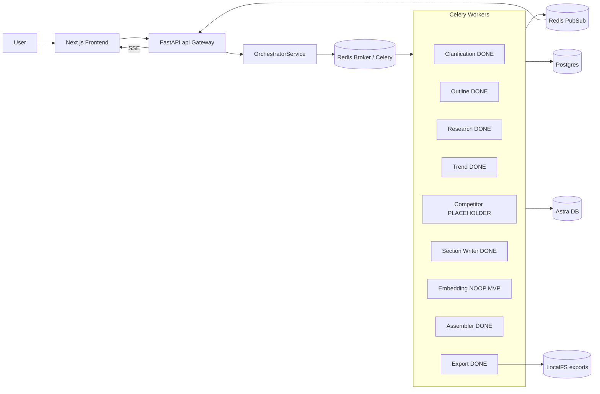

## 1. End-to-End Pipeline Status

## 2. Component-by-Component Status

### 2.1 Backend workers ([stratos-backend/app/workers](stratos-backend/app/workers))

- Clarification Worker [stratos-backend/app/workers/clarification_worker.py](stratos-backend/app/workers/clarification_worker.py) - DONE. Multi-turn chat, schema accumulation, confidence gate at 0.95, emits `clarification_update`/`clarification_ready`. Validated in [TEST_RUN_01.md](TEST_RUN_01.md).
- Outline Worker [stratos-backend/app/workers/outline_worker.py](stratos-backend/app/workers/outline_worker.py) - DONE. Idempotent section persistence, emits `outline_ready`. Section ids may still be null in SSE payload (event built before flush) - low-priority cosmetic.
- Research Worker [stratos-backend/app/workers/research_worker.py](stratos-backend/app/workers/research_worker.py) - DONE. SerpAPI fan-out, dedupe, Postgres + Astra writes, emits `searching_sources`/`research_done`/`research_failed`.
- Trend Worker [stratos-backend/app/workers/trend_worker.py](stratos-backend/app/workers/trend_worker.py) - DONE (just shipped). HN/GDELT/Google News RSS/arXiv parallel fan-out, Postgres + Astra `trend_items`, async parallel to research.
- Competitor Worker - PLACEHOLDER. File missing, dispatch commented out in orchestrator. Astra `competitor_insights` collection only has a reader, no writer.
- Section Writer [stratos-backend/app/workers/section_worker.py](stratos-backend/app/workers/section_worker.py) - DONE. Builds context from Astra bundles + Postgres fallback, validates citations, persists `Chunk` + `Citation`, streams `section_chunk`, emits `section_done`/`section_failed`.
- Embedding Worker [stratos-backend/app/workers/embedding_worker.py](stratos-backend/app/workers/embedding_worker.py) - INTENTIONAL NO-OP for MVP. Only emits `embedding_skipped`. Required for the future Deep Dive feature, not for MVP report.
- Assembler Worker [stratos-backend/app/workers/assembler_worker.py](stratos-backend/app/workers/assembler_worker.py) - DONE (lightweight). Concatenates section chunks into `exports/{report_id}.json` and sets report status. Does NOT call LLM polish - acceptable for MVP.
- Export Worker [stratos-backend/app/workers/export_worker.py](stratos-backend/app/workers/export_worker.py) - DONE. ReportLab PDF, writes `ExportRecord`, emits `export_done`/`export_failed`.

### 2.2 Backend services ([stratos-backend/app/services](stratos-backend/app/services))

All present and implemented:
- `orchestrator_service.py` - state machine + Celery dispatch + SSE events.
- `research_service.py`, `trend_service.py` - provider integrations.
- `evidence_ranker.py`, `evidence_bundle_service.py` - per-section ranking.
- `astra_evidence_repository.py` - Astra adapter (evidence + trend_items + bundles + competitor_insights READER ONLY).
- `section_writer_service.py` - Section Writer context builder + LLM call + validation.

### 2.3 Backend API ([stratos-backend/app/api](stratos-backend/app/api))

- `auth.py` -> `POST /auth/google` (working).
- `sse.py` -> `GET /stream/events` (working).
- `orchestrator.py` -> `POST /start-session`, `/clarification/chat`, `/clarification/accept-consent`, `GET /status/{session_id}` - WORKS but BUG: router declares `prefix="/orchestrate"` AND `main.py` mounts it with `prefix="/orchestrate"` again, producing `/orchestrate/orchestrate/...`. Frontend client mirrors the bug.
- MISSING for MVP: no `GET /reports/{report_id}` (final report content) and no `GET /exports/{report_id}/file` (PDF download).

### 2.4 Postgres + Astra

- All Postgres models in [stratos-backend/app/db/models.py](stratos-backend/app/db/models.py) cover the pipeline. No migration tooling (Alembic) - schema applied via [stratos-backend/scripts/create_tables.py](stratos-backend/scripts/create_tables.py).
- Astra collections used: `evidence`, `evidence_bundles`, `trend_items`. `competitor_insights` is read-only (placeholder).

### 2.5 State machine

[stratos-backend/app/utils/state_machine.py](stratos-backend/app/utils/state_machine.py) only defines an enum. All transitions live in orchestrator. Two minor issues:
- Assembler/Export workers write string literals (`"READY_FOR_EXPORT"`, `"EXPORTED"`) directly on `report.status`; `"EXPORTED"` is NOT in the enum.
- Orchestrator `handle_outline_ready` flips OUTLINE_GENERATED then RESEARCH_RUNNING with two commits in succession (cosmetic, not buggy).

### 2.6 Frontend ([stratos-frontend](stratos-frontend))

- Routes: `/` (chat shell) and `/login` (info stub). No OAuth wired.
- API client at [stratos-frontend/src/lib/api/orchestratorClient.ts](stratos-frontend/src/lib/api/orchestratorClient.ts) targets the doubled `/orchestrate/orchestrate/...` paths.
- SSE handled via [stratos-frontend/src/lib/sse/useEventStream.ts](stratos-frontend/src/lib/sse/useEventStream.ts) and reduced via `eventToActions` in [stratos-frontend/src/lib/state/chatFlowStore.ts](stratos-frontend/src/lib/state/chatFlowStore.ts).
- HANDLED events: `clarification_update`, `clarification_consent_requested`, `outline_ready`, `research_started`, `searching_sources`, `research_done`, `scanning_trends`, `trend_ready`, `section_chunk`, `section_done`, `export_ready`, `export_done`, `competitor_*`, plus `*_failed` substring match.
- IGNORED events that the backend actually emits: `session_created`, `clarification_started`, `clarification_completed`, `outline_accepted`, `section_writing_started`, `sections_done`, `report_assembled`, `embedding_skipped`, `trend_failed` (only via substring).
- STUBBED UI: demo login token in [stratos-frontend/src/components/chat/ChatShell.tsx](stratos-frontend/src/components/chat/ChatShell.tsx); placeholder section after `research_done`; placeholder final-report body on `export_done`; "Download PDF" button shows info message.

### 2.7 Tests + scripts

- Only one unit test: [stratos-backend/tests/test_section_writer_service.py](stratos-backend/tests/test_section_writer_service.py).
- No integration / API tests; no e2e harness. Manual log: [TEST_RUN_01.md](TEST_RUN_01.md).
- Scripts: only `create_tables.py`. No seed / smoke run script.

## 3. MVP Gaps (Prioritized)

### P0 - Blocks shippable MVP
1. End-to-end smoke run not verified past `research_done` since trend+section+assembler+export landed. Need a fresh run that produces a real PDF.
2. Final report not visible in UI - frontend uses a placeholder string on `export_done`. Need REST endpoint to fetch assembled content + PDF download.
3. PDF download button is disabled in [ChatShell.tsx](stratos-frontend/src/components/chat/ChatShell.tsx). Need wire-up to the new file endpoint.
4. Frontend ignores `report_assembled`, `sections_done`, `section_writing_started` so progress UI freezes between section streaming and PDF.

### P1 - Required for usable MVP
5. Orchestrator double-prefix `/orchestrate/orchestrate/...` is functional but should be fixed (single source of truth) and frontend client adjusted.
6. Status string drift: assembler/export use literal `"READY_FOR_EXPORT"` and `"EXPORTED"` - normalize to `SessionState` enum and add `EXPORTED` member.
7. SSE `outline_ready` payload sometimes has `section_id: null` because IDs read pre-flush (from [TEST_RUN_01.md](TEST_RUN_01.md)). Easy fix in [outline_worker.py](stratos-backend/app/workers/outline_worker.py).
8. Trend Worker latency: trend items may not be on Astra by the time a section writer runs. Acceptable for MVP, but document this race in code.
9. Add a smoke-run script under [stratos-backend/scripts/](stratos-backend/scripts) so any future regression can be detected without manual API calls.

### P2 - Nice-to-have for MVP polish
10. Real OAuth (replace demo login token) in [ChatShell.tsx](stratos-frontend/src/components/chat/ChatShell.tsx) using existing `/auth/google` endpoint.
11. Surface trend evidence in the report panel ([ReportSplitPanel.tsx](stratos-frontend/src/components/report/ReportSplitPanel.tsx)) so users can see trends were used.
12. Minimal Alembic migration setup so schema is reproducible.
13. Promote `embedding_worker` from no-op to real embedding storage when Deep Dive becomes a goal (post-MVP).
14. Competitor Worker - keep as placeholder; document the seam in this plan only.

## 4. Roadmap (ordered next steps)

Each step lists the exact files to change and is sized for one focused PR.

### Step A - Wire MVP report retrieval (P0)
- Add `GET /reports/{report_id}` in [stratos-backend/app/api/orchestrator.py](stratos-backend/app/api/orchestrator.py) returning `{status, sections: [{title, order_index, chunks:[{text, citations:[{marker,url,domain}]}]}], assembled_json_path}`.
- Add `GET /exports/{report_id}/file` returning the PDF via FastAPI `FileResponse` from `ExportRecord.file_url`.
- New methods on [stratos-backend/app/services/orchestrator_service.py](stratos-backend/app/services/orchestrator_service.py): `get_report_view(report_id)` and `get_export_path(report_id)`.

### Step B - Frontend wires the report (P0)
- Extend [orchestratorClient.ts](stratos-frontend/src/lib/api/orchestratorClient.ts) with `fetchReport(reportId)` and `getExportFileUrl(reportId)`.
- In [chatFlowStore.ts](stratos-frontend/src/lib/state/chatFlowStore.ts) add reducer cases for `report_assembled`, `sections_done`, `section_writing_started`, `export_done` that:
  - track `reportId` (already accepting via outline event - confirm).
  - on `export_done` trigger an action that fetches the final report and stores it in state.
- [ReportSplitPanel.tsx](stratos-frontend/src/components/report/ReportSplitPanel.tsx) renders the real report once present.
- [PdfDownloadButton.tsx](stratos-frontend/src/components/report/PdfDownloadButton.tsx) hits `getExportFileUrl(reportId)` and removes the "not enabled" stub in [ChatShell.tsx](stratos-frontend/src/components/chat/ChatShell.tsx).

### Step C - Fix orchestrator URL prefix (P1)
- Pick a single owner. Recommended: drop `prefix="/orchestrate"` from the `APIRouter(...)` in [orchestrator.py](stratos-backend/app/api/orchestrator.py) and keep it on the `app.include_router(...)` call in [main.py](stratos-backend/app/main.py).
- Update all 4 paths in [orchestratorClient.ts](stratos-frontend/src/lib/api/orchestratorClient.ts) to single `/orchestrate/...`.

### Step D - State enum normalization (P1)
- Add `EXPORTED = "EXPORTED"` to [state_machine.py](stratos-backend/app/utils/state_machine.py).
- Replace string assignments in [assembler_worker.py](stratos-backend/app/workers/assembler_worker.py) and [export_worker.py](stratos-backend/app/workers/export_worker.py) with `SessionState.READY_FOR_EXPORT` / `SessionState.EXPORTED`.

### Step E - Outline event payload includes ids (P1)
- In [outline_worker.py](stratos-backend/app/workers/outline_worker.py), build the `sections` event payload AFTER `db.commit()` (or `db.flush()` then read `section.id`) so the SSE event carries real ids.
- Frontend can then bind sections by id rather than title.

### Step F - SSE event coverage parity (P0/P1)
- Add `clarification_started`, `outline_accepted`, `section_writing_started`, `sections_done`, `report_assembled`, `trend_failed` to `BackendEventType` in [stratos-frontend/src/lib/sse/events.ts](stratos-frontend/src/lib/sse/events.ts).
- Add reducer cases in [chatFlowStore.ts](stratos-frontend/src/lib/state/chatFlowStore.ts) so the progress timeline shows the full pipeline. No new backend events; only consume what already fires.

### Step G - Smoke run script (P1)
- Add `stratos-backend/scripts/run_pipeline_smoke.py` that:
  1. POSTs `/orchestrate/start-session`,
  2. polls SSE OR `GET /status/...` until `AWAITING_CONSENT`,
  3. POSTs `/clarification/accept-consent`,
  4. polls until `READY_FOR_EXPORT` and PDF exists.
- Print pass/fail summary. No pytest required for MVP, but useful as a single command.

### Step H - OAuth wiring (P2)
- Replace demo token in [ChatShell.tsx](stratos-frontend/src/components/chat/ChatShell.tsx) with Google Sign-In; pass `id_token` to existing `POST /auth/google` and store the returned JWT in component state.

### Step I - Competitor Worker placeholder (deferred)
- Keep stubs:
  - Empty file [stratos-backend/app/workers/competitor_worker.py](stratos-backend/app/workers/competitor_worker.py) NOT created (Celery import-loop already tolerates missing module).
  - Orchestrator dispatch line stays commented in [orchestrator_service.py](stratos-backend/app/services/orchestrator_service.py).
  - Astra `competitor_insights` reader stays in [astra_evidence_repository.py](stratos-backend/app/services/astra_evidence_repository.py).
  - Section Writer continues to read empty competitor list gracefully.
- This plan is the placeholder document; nothing else to do for MVP.

## 5. Out Of Scope (explicit, post-MVP)

- Real Embedding Worker + Astra vector inserts.
- Deep Dive Q+A (`POST /reports/{id}/deep-dive`).
- LLM polish in Assembler.
- Sentiment / forecasting in Trend.
- Competitor Worker implementation.
- Alembic migrations / multi-tenant security review.
- Worker DLQ + admin replay UI.

## 6. How To Read This Plan Later

The Status sections (1, 2) are a snapshot. The Roadmap (4) is the live to-do board for MVP completion. When a step is finished, mark its todo `completed` in this plan's frontmatter and write a one-line note in section 2.x for the relevant component pointing at the change.