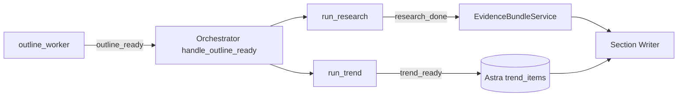

## 1. Design Choices (confirmed)

- Async parallel: enqueue `run_trend.delay(report_id)` in `handle_outline_ready` next to `run_research.delay(...)`. Section Writer already reads trend items via `astra_evidence_repository.fetch_trend_items()` ([stratos-backend/app/services/astra_evidence_repository.py](stratos-backend/app/services/astra_evidence_repository.py) lines 116-117), so no orchestrator fan-in is required.
- Free providers only (no charges, no keys):
  - Hacker News Algolia search (`https://hn.algolia.com/api/v1/search_by_date`)
  - GDELT 2.0 DOC API via `gdeltdoc` PyPI client (no key)
  - Google News RSS (`https://news.google.com/rss/search`) parsed with `feedparser`
  - arXiv Atom API (`https://export.arxiv.org/api/query`) parsed with `feedparser`

## 2. Pipeline Position



Section writers read trend_items only if present, so the trend pipeline can fail soft without blocking the report.

## 3. Files To Create

### 3.1 [stratos-backend/app/services/trend_service.py](stratos-backend/app/services/trend_service.py) (new)

Mirrors `ResearchService` shape from [stratos-backend/app/services/research_service.py](stratos-backend/app/services/research_service.py).

Public methods:
- `generate_queries(clarified_summary: str) -> list[str]`: reuse the same LLM-with-fallback pattern as `ResearchService.generate_queries`, but with a trend-focused prompt (`TREND_QUERY_PROMPT`). Fallback queries: `["industry trends", "market growth", "recent news"]`. Cap at 4 queries.
- `fetch_hackernews(query, limit) -> list[dict]`: hits `hn.algolia.com/api/v1/search_by_date?query=...&tags=story&numericFilters=created_at_i>UNIX_90_DAYS_AGO&hitsPerPage=limit`. Maps to `{title, url, summary=story_text or '', published_at, provider="hn_algolia", category="social"}`.
- `fetch_gdelt(query, days) -> list[dict]`: uses `gdeltdoc.GdeltDoc().article_search(Filters(keyword=query, start_date=..., end_date=...))`. Maps to `{title, url, summary=seendate, provider="gdelt", category="news"}`.
- `fetch_google_news_rss(query, limit) -> list[dict]`: uses `feedparser.parse("https://news.google.com/rss/search?q=...&hl=en-US&gl=US&ceid=US:en")`. Maps to `{title, url=link, summary=summary, published_at=published, provider="google_news_rss", category="news"}`.
- `fetch_arxiv(query, limit) -> list[dict]`: uses `feedparser.parse("https://export.arxiv.org/api/query?search_query=all:...&max_results=...&sortBy=submittedDate&sortOrder=descending")`. Maps to `{title, url=link, summary=summary, published_at=published, provider="arxiv", category="papers"}`.
- `_run_provider_safe(fn, *args)`: try/except that returns `[]` on any failure and logs. All four providers wrapped in this so any one failure does not break the worker.
- `dedupe_items(items: list[dict]) -> list[dict]`: dedup by normalized URL and by `(provider, lowered_title)` to catch reposts.
- `cap_items(items: list[dict], max_per_category: int = 15) -> list[dict]`: keep the freshest N per category to bound output (~60 items max).
- `persist_postgres(report_id, items) -> dict[str, str]`: groups items by `category`, ensures one `models.Trend` row per `(report_id, category)`, then inserts `models.TrendItem` rows. Returns `{category: trend_id}` map.
- `persist_astra(report_id, items, trend_id_by_category)`: builds document and calls a new `AstraEvidenceRepository.save_trend_item(...)` per item.

Keep all SERP-style HTTP calls behind `requests.get(..., timeout=10)` with a sane User-Agent; mimic style in `ResearchService.scrape_and_extract`.

### 3.2 [stratos-backend/app/workers/trend_worker.py](stratos-backend/app/workers/trend_worker.py) (new)

Same Celery decorator shape as Research Worker. Skeleton:

```python
@celery_app.task(
    bind=True,
    autoretry_for=(Exception,),
    retry_backoff=10,
    retry_kwargs={"max_retries": 3},
)
def run_trend(self, report_id: str):
    db = SessionLocal()
    try:
        report = db.query(models.Report).filter_by(id=report_id).first()
        session = db.query(models.Session).filter_by(id=report.session_id).first()
        if not session or not session.clarified_summary:
            raise ValueError("Clarified summary missing")

        publish_event("scanning_trends", {"report_id": report_id})

        service = TrendService(db=db)
        queries = service.generate_queries(session.clarified_summary)

        all_items = []
        with ThreadPoolExecutor(max_workers=4) as ex:
            futures = []
            for q in queries:
                futures.append(ex.submit(service._run_provider_safe, service.fetch_hackernews, q, 10))
                futures.append(ex.submit(service._run_provider_safe, service.fetch_gdelt, q, 90))
                futures.append(ex.submit(service._run_provider_safe, service.fetch_google_news_rss, q, 10))
                futures.append(ex.submit(service._run_provider_safe, service.fetch_arxiv, q, 10))
            for fut in as_completed(futures):
                all_items.extend(fut.result() or [])

        deduped = service.dedupe_items(all_items)
        capped = service.cap_items(deduped)

        trend_ids_by_category = service.persist_postgres(report_id, capped)
        service.persist_astra(report_id, capped, trend_ids_by_category)

        publish_event("trend_ready", {
            "report_id": report_id,
            "trend_count": len(capped),
            "by_category": _count_by_category(capped),
        })
    except Exception as e:
        publish_event("trend_failed", {"report_id": report_id, "error": str(e)})
        raise
    finally:
        db.close()
```

## 4. Files To Modify

### 4.1 [stratos-backend/app/services/orchestrator_service.py](stratos-backend/app/services/orchestrator_service.py)

In `handle_outline_ready` (around line 225), uncomment `run_trend.delay(report.id)` and add the import. Already wired with TODO:

```206:227:stratos-backend/app/services/orchestrator_service.py
        publish_event(
            "research_started",
            {
                "session_id": session.id,
                "report_id": report.id,
            }
        )

        run_research.delay(report.id)
        # run_trend.delay(report.id)
        # run_competitor.delay(report.id)
```

Replace the commented line with `from app.workers.trend_worker import run_trend` at top and `run_trend.delay(report.id)` in the body. Do NOT touch `handle_research_done` — section writer dispatch should remain triggered solely by research_done so trend latency cannot stall the report.

### 4.2 [stratos-backend/app/services/astra_evidence_repository.py](stratos-backend/app/services/astra_evidence_repository.py)

Add a writer counterpart to the already-present reader `fetch_trend_items` (line 116-117):

```python
def save_trend_item(self, document: dict[str, Any]) -> str | None:
    if not self.enabled:
        return None
    trend_item_id = document.get("trend_item_id")
    payload = dict(document)
    if trend_item_id:
        payload.setdefault("_id", trend_item_id)
    try:
        self._collection("trend_items").insert_one(payload)
        return trend_item_id
    except Exception:
        logger.exception("[ASTRA] Failed to save trend item")
        return None
```

This keeps the same fail-soft pattern as `save_evidence_document`.

### 4.3 [stratos-backend/app/llm/prompts.py](stratos-backend/app/llm/prompts.py)

Add `TREND_QUERY_PROMPT` modeled on `RESEARCH_QUERY_PROMPT`. Expected output JSON `{"queries": [...]}`, instructing the LLM to emit 3-4 trend-oriented queries (e.g. "freelance platforms market growth 2026", "AI agents for sales prospecting trends") of 3-12 words each. Used by `TrendService.generate_queries`.

### 4.4 [stratos-backend/requirements.txt](stratos-backend/requirements.txt) (or pyproject)

Add (pip-confirmed free, MIT/Apache):
- `gdeltdoc` (GDELT 2.0 client)
- `feedparser` (Google News RSS + arXiv Atom)

`requests` is already in tree.

## 5. Astra Document Shape

Per item written to `trend_items`:

```python
{
    "trend_item_id": str(uuid.uuid4()),
    "report_id": report_id,
    "trend_id": trend_id_for_category,       # FK back to Postgres
    "category": "news" | "papers" | "social" | "tech",
    "provider": "hn_algolia" | "gdelt" | "google_news_rss" | "arxiv",
    "title": "...",
    "url": "...",
    "summary": "...",                        # short text / abstract
    "text": "...",                           # snippet for Section Writer use
    "published_at": "ISO-8601 or None",
    "created_at": datetime.utcnow().isoformat(),
}
```

## 6. Postgres Persistence

Existing models from [stratos-backend/app/db/models.py](stratos-backend/app/db/models.py) lines 185-207 already match the contract:
- `Trend(id, report_id, category)` — created lazily per category.
- `TrendItem(id, trend_id, title, url, summary, published_at)` — one per item.

No migration needed.

## 7. Events Emitted

- `scanning_trends` — `{report_id}`
- `trend_ready` — `{report_id, trend_count, by_category}`
- `trend_failed` — `{report_id, error}`

These flow through Redis Pub/Sub and out to the frontend SSE stream automatically; no `redis_sub.py` orchestrator handler is needed because trend results are async best-effort. (If we later want fan-in, add a handler in [stratos-backend/app/utils/redis_sub.py](stratos-backend/app/utils/redis_sub.py) — out of scope for this MVP.)

## 8. Failure Semantics

- Per-provider failure: caught in `_run_provider_safe`, logged, returns `[]`.
- Empty result set: still emits `trend_ready` with `trend_count=0` so the frontend can show "no trends found".
- Hard failure (e.g. DB outage): Celery autoretry x3 with backoff, then `trend_failed`.
- Astra disabled: `AstraEvidenceRepository.save_trend_item` returns `None` silently — Postgres remains source of truth, matching the existing Astra fail-soft pattern.

## 9. Acceptance Tests

- Run start-session → clarification → accept-consent → outline_ready.
- Verify SSE stream shows `scanning_trends` then `trend_ready` with non-zero counts.
- Verify Postgres `trends` and `trend_items` rows exist for the report.
- Verify Astra `trend_items` collection contains one document per Postgres TrendItem (when Astra credentials present).
- Force one provider to error (e.g. break GDELT URL) → other three still produce items, worker still emits `trend_ready`.
- Verify Section Writer can call `astra_evidence_repository.fetch_trend_items(report_id, ...)` and receive the persisted documents.

## 10. Out Of Scope (deferred)

- LLM trend categorization / sentiment scoring (rule-based category from provider for MVP).
- Reddit JSON scraping (deferred per provider choice).
- Per-section trend ranking (Section Writer can filter on its own; can later be added to `EvidenceBundleService`).
- Forecasting, time-series, regional segmentation (per docs MVP exclusions).