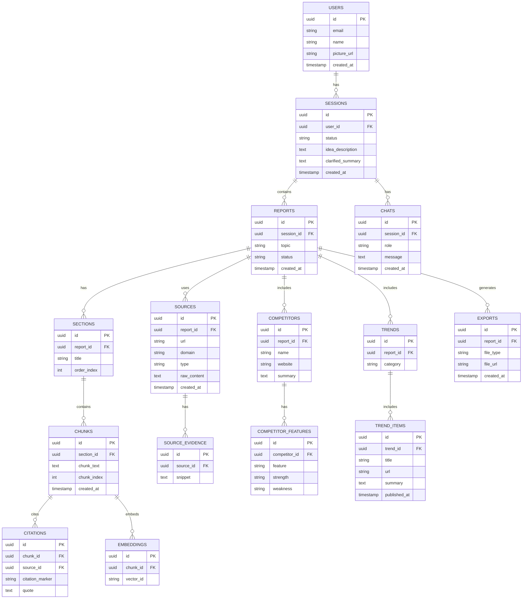

# DB Schema

# ⭐ **WHAT’S STORED IN POSTGRES VS ASTRA DB?**

---

# 📌 **POSTGRES (Relational Database)**

Stores **ALL structured metadata**, NOT embeddings or evidence.

### **Tables:**

### **1. users**

- id
- email
- name
- created_at
- last_login

### **2. sessions**

- session_id
- user_id (FK)
- status
- created_at

### **3. reports**

- report_id
- session_id (FK)
- idea_summary
- problem_statement
- persona
- status
- created_at

### **4. sections**

- section_id
- report_id (FK)
- title
- order_index

### **5. chunks**

- chunk_id
- section_id (FK)
- text
- inline_citations → `[CIT-001, CIT-003, ...]`
- created_at

### **6. citations**

- citation_id
- chunk_id (FK)
- source_id
- citation_marker

### **7. chat_messages**

- message_id
- session_id (FK)
- role ("user", "assistant")
- text
- created_at

### **8. exports**

- export_id
- report_id (FK)
- file_path
- file_type
- created_at

---

# 📌 **ASTRA DB (Vector + Evidence Store)**

Stores **everything unstructured**, embeddable, or high-volume.

### Collections:

### **1. sources**

```json
{
  "source_id": "...",
  "url": "...",
  "domain": "...",
  "title": "...",
  "clean_text": "...",
  "report_id": "...",
  "metadata": {}
}

```

### **2. trend_items**

(news, papers, social signals)

### **3. competitor_evidence**

(features, pricing, pros/cons)

### **4. chunks_vector**

Each vector search entry:

```json
{
  "chunk_id": "...",
  "section_id": "...",
  "report_id": "...",
  "embedding": [...],
  "text": "...",
  "citations": [...],
  "vector": [...],
  "metadata": {...}
}

```

### **5. evidence_bundles**

Used only to feed SectionW.

---

# ⭐ UPDATED ER DIAGRAM (VALID MERMAID ERD)



---

Below is:

# ⭐ **1. ASTRA DB SCHEMA (VECTOR STORE + EVIDENCE STORE)**

# ⭐ **2. Purpose of *every* Postgres table — clearly explained**

This is fully aligned with your final architecture:

- **Astra DB** → embeddings + evidence + trend data + competitor extracted content
- **Postgres** → structured relational metadata (reports, sections, chunks, citations, etc.)

Let’s start with Astra.

---

# ⭐ 1️⃣ **ASTRA DB SCHEMA (VECTOR + EVIDENCE STORE)**

Astra stores **3 major types** of data:

---

## ⭐ **A. Collection 1 → `embeddings` (Vector Search)**

Stores semantic search vectors for chunks used in **Deep Dive / RAG**.

### **Schema (CQL / JSON model)**

```json
{
  "chunk_id": "uuid",
  "report_id": "uuid",
  "section_id": "uuid",
  "vector": [0.123, -0.542, ...],
  "text": "The competitor X has weak onboarding...",
  "citations": ["source_id_1", "source_id_2"],
  "keywords": ["competitor", "onboarding", "friction"],
  "created_at": "timestamp"
}

```

### **Vector Index (Astra Vector Search)**

```
CREATE CUSTOM INDEX ON embeddings(vector)
USING 'StorageAttachedIndex';

```

### Purpose

Used for:

- Finding relevant chunks during follow-up questions
- Grounding answers with evidence
- “Explain more about X competitor”
- “Show trends related to Y”
- “Summarize opportunities again”

This enables **true deep-dive intelligence**.

---

## ⭐ **B. Collection 2 → `evidence` (Raw scraped content)**

Stores the **actual extracted data** from:

- Website scraping
- SERP results
- Product pages
- News articles
- Research papers
- Reddit posts
- Competitor docs

### **Schema**

```json
{
  "evidence_id": "uuid",
  "report_id": "uuid",
  "source_id": "uuid",
  "url": "https://example.com",
  "title": "What customers think about X",
  "raw_text": "...full cleaned extracted text...",
  "snippets": [
      "Snippet 1...",
      "Snippet 2..."
  ],
  "type": "news | paper | social | serp | competitor",
  "domain": "techcrunch.com",
  "metadata": {
      "author": "John Doe",
      "published_at": "2024-03-05"
  }
}

```

### Purpose

- Gives Section Writers access to real evidence
- Enables citation extraction
- Improves accuracy of competitor / trend / news analysis
- Allows future reprocessing

This is your **ground truth** storage for research.

---

## ⭐ **C. Collection 3 → `trend_items`**

Stores curated signals such as:

- News highlights
- Abstracts of research papers
- Reddit discussions
- Twitter sentiment

### **Schema**

```json
{
  "trend_item_id": "uuid",
  "report_id": "uuid",
  "title": "AI adoption in healthcare grows 30%",
  "url": "https://news.com/article1",
  "summary": "Short curated summary…",
  "sentiment": "positive | negative | neutral",
  "published_at": "timestamp",
  "category": "news | paper | social"
}

```

### Purpose

These items are used to:

- Generate the trends section
- Support deep dives (“What is the latest news about this?”)
- Provide citations
- Enable trend-based insights

---

# ⭐ **D. Collection 4 → `competitor_insights`**

Stores structured competitor information extracted via LLM & scraping.

### **Schema**

```json
{
  "insight_id": "uuid",
  "report_id": "uuid",
  "competitor_name": "Notion",
  "strengths": ["Easy UX", "Templates marketplace"],
  "weaknesses": ["Weak offline mode"],
  "pricing": "$8/month",
  "feature_list": ["Kanban", "Wiki", "Docs"],
  "raw_evidence_ids": ["evidence_id_1", "evidence_id_2"]
}

```

### Purpose

- Power the competitor analysis section
- Support deep dives (“Tell me more about Notion’s weaknesses”)
- Enables multi-dimensional comparison

---

# ⭐ SUMMARY: ASTRA DB = (High-volume unstructured store + vector store)

| Collection | Purpose |
| --- | --- |
| embeddings | Semantic search for deep dives |
| evidence | Raw extracted research |
| trend_items | News/research/social signals |
| competitor_insights | Structured competitor intelligence |

---

# ⭐ 2️⃣ POSTGRES SCHEMA PURPOSE (Every Table Explained)

Below is a **simple, crystal-clear explanation** of how each table fits into the system.

---

# ⭐ **A. USERS TABLE**

### Purpose

Stores user accounts from Google OAuth.

### Why needed?

- Identify users
- Limit report usage
- Store chat history per user

---

# ⭐ **B. SESSIONS TABLE**

### Purpose

Represents a **conversation session**.

### Why needed?

- Each idea exploration → 1 session
- Chat messages attach to a session
- Reports attach to sessions

---

# ⭐ **C. REPORTS TABLE**

### Purpose

Stores global metadata about the report:

- topic
- status
- timestamps
- idea summary

### Why needed?

It is the **root object** for:

- sections
- sources
- competitor analysis
- trends
- exports

---

# ⭐ **D. SECTIONS TABLE**

### Purpose

Contains the outline:

- “Problem Statement”
- “Persona Analysis”
- “Competitor Analysis”
- “Market Trends”
- “Opportunities”

### Why needed?

Section Writer Worker generates text for each of these in order.

---

# ⭐ **E. CHUNKS TABLE**

### Purpose

Stores **streamed text chunks** of each section.

Chunking is needed for:

- Streaming UX
- Precise citation mapping
- Embedding generation

---

# ⭐ **F. CITATIONS TABLE**

### Purpose

Maps:

**chunk → source → citation marker**

e.g.:

```
[CIT-5] → Gartner Report (2024)

```

### Why needed?

- Inline citations
- Export formatting
- Deep-dive referencing

---

# ⭐ **G. EMBEDDINGS TABLE**

### Purpose

Links a chunk to the **vector_id stored in Astra**.

### Why needed?

Postgres doesn’t store vectors.

It only stores mapping:

```
chunk_id → vector row in Astra

```

---

# ⭐ **H. SOURCES TABLE**

### Purpose

Metadata for all URLs used in research:

- URL
- domain
- type (news/competitor/paper/social)

Evidence lives in Astra, metadata lives in Postgres.

---

# ⭐ **I. SOURCE_EVIDENCE TABLE**

### Purpose

Stores small reference snippets extracted from evidence.

Why not store full scraped text here?

→ Full text goes to Astra.

→ Snippets stored here are used for quick citations and summaries.

---

# ⭐ **J. COMPETITORS TABLE**

### Purpose

Stores the list of discovered competitors for this report.

---

# ⭐ **K. COMPETITOR_FEATURES TABLE**

### Purpose

Stores structured competitor feature lists:

```
Feature, Strength, Weakness

```

---

# ⭐ **L. TRENDS TABLE**

### Purpose

Represents a grouping for trends (news/papers/social).

---

# ⭐ **M. TREND_ITEMS TABLE**

### Purpose

Stores individual trend entries used in the report.

---

# ⭐ **N. CHATS TABLE**

### Purpose

Stores full chat history of the session:

- User messages
- Assistant responses
- Deep dive Q&A

Absolutely needed for:

- Continuity
- Context for the next question
- Exporting conversation transcripts

---

# ⭐ **O. EXPORTS TABLE**

### Purpose

Stores exported files:

- PDF
- HTML

Includes:

- file URL
- type
- timestamp

---

# ⭐ Want SQL CREATE TABLEs?

If you'd like, I can generate the **full SQL schema**, including:

- Primary keys
- Foreign keys
- Indexing recommendations
- Optimal constraints
- Cascade rules

Just say:

👉 **“Give me the SQL schema.”**

Perfect — here is the **complete mapping** you asked for:

---

# ⭐ **1. For each Worker: which Postgres tables + which Astra DB collections are used**

This is the **clearest, simplest, and most accurate breakdown** of your entire system’s data flow.

---

# ⭐ **WORKER → DATABASE ACCESS TABLE**

| Worker | Reads From (Postgres) | Writes To (Postgres) | Reads From (Astra) | Writes To (Astra) |
| --- | --- | --- | --- | --- |
| **Outline Worker** | reports | sections | — | — |
| **Research Worker** | reports | sources | — | evidence |
| **Trend Worker** | reports | trends, trend_items | — | trend_items |
| **Competitor Worker** | reports | competitors, competitor_features | evidence (raw text snippets) | competitor_insights |
| **Section Writer Worker** | reports, sections, sources, trend_items, competitor_features | chunks, citations | evidence, competitor_insights | citations (extended), evidence links |
| **Embedding Worker** | chunks | embeddings (vector_id link) | — | embeddings (vector rows) |
| **Assembler Worker** | sections, chunks, citations, competitors, competitor_features, trend_items | reports (final_text) | — | — |
| **Export Worker** | reports | exports | — | — |
| **Deep Dive (Orchestrator)** | chunks, citations, chats | chats | embeddings | — |

---

# ⭐ **2. POSTGRES RELATIONSHIPS → Full Explanation**

Here is how **every table links to others**:

---

## ⭐ **A. USERS → SESSIONS**

```
USERS.id = SESSIONS.user_id

```

- One user can have many sessions (idea threads)

---

## ⭐ **B. SESSIONS → REPORTS**

```
SESSIONS.id = REPORTS.session_id

```

- One session → one report
- The report is the generated analysis for that idea

---

## ⭐ **C. REPORTS → SECTIONS**

```
REPORTS.id = SECTIONS.report_id

```

- A report contains multiple sections (outline)

---

## ⭐ **D. SECTIONS → CHUNKS**

```
SECTIONS.id = CHUNKS.section_id

```

- Each section streams many chunks
- Chunks are atomic text units used for embedding

---

## ⭐ **E. CHUNKS → CITATIONS**

```
CHUNKS.id = CITATIONS.chunk_id

```

- Each chunk may reference multiple citations

---

## ⭐ **F. SOURCES → SOURCE_EVIDENCE**

```
SOURCES.id = SOURCE_EVIDENCE.source_id

```

- Each source URL has zero or many extracted evidence snippets

---

## ⭐ **G. REPORTS → SOURCES**

```
REPORTS.id = SOURCES.report_id

```

- All sources discovered for this report are listed here
- Evidence lives in Astra; metadata lives in Postgres

---

## ⭐ **H. REPORTS → COMPETITORS**

```
REPORTS.id = COMPETITORS.report_id

```

- A report may discover many competitors

---

## ⭐ **I. COMPETITORS → COMPETITOR_FEATURES**

```
COMPETITORS.id = COMPETITOR_FEATURES.competitor_id

```

- Each competitor has structured feature list items

---

## ⭐ **J. REPORTS → TRENDS**

```
REPORTS.id = TRENDS.report_id

```

---

## ⭐ **K. TRENDS → TREND_ITEMS**

```
TRENDS.id = TREND_ITEMS.trend_id

```

---

## ⭐ **L. SESSIONS → CHATS**

```
SESSIONS.id = CHATS.session_id

```

- Stores conversation history for deep dives

---

## ⭐ **M. REPORTS → EXPORTS**

```
REPORTS.id = EXPORTS.report_id

```

---

# ⭐ **3. Mapping: Which Postgres Tables Link to Which Astra Collections**

Here is the cross-database relationship mapping you asked for:

| Postgres Table | Related Astra Collection | How They Connect |
| --- | --- | --- |
| **chunks** | embeddings | `chunk_id` → embedding.vector |
| **sources** | evidence | `source_id` → evidence.source_id |
| **trend_items** | trend_items | Both store the same ID for cross lookup |
| **competitors** | competitor_insights | competitor_name or competitor_id |
| **citations** | evidence | Provides `source_id` used for citation recovery |

---

# ⭐ **DETAILED CROSS-DB RELATIONSHIP DESCRIPTIONS**

Let’s explain each link clearly:

---

# 🔹 **1. CHUNKS (Postgres) ↔ EMBEDDINGS (Astra)**

### Postgres:

```
chunks.id = chunk_id
embeddings.vector_id = Astra row that stores actual vector

```

### Astra:

```
{
   chunk_id: "uuid",
   vector: [...]
}

```

**Purpose:**

Used for RAG deep-dive search.

---

# 🔹 **2. SOURCES (Postgres) ↔ EVIDENCE (Astra)**

### Postgres:

```
sources.id = source_id

```

### Astra:

```
{
  source_id: "...",
  raw_text: "...",
  snippets: [...]
}

```

**Purpose:**

Store large scraped content in Astra, only metadata in Postgres.

---

# 🔹 **3. TREND_ITEMS (Postgres) ↔ trend_items (Astra)**

These both store curated trend info but for different purposes:

- Postgres → metadata for report rendering
- Astra → extended content (snippets, raw summaries)

A shared `trend_item_id` connects them.

---

# 🔹 **4. COMPETITORS (Postgres) ↔ competitor_insights (Astra)**

- Postgres: structured features
- Astra: raw evidence + extracted insights

Connection:

```
competitors.name or competitors.id → competitor_insights.report_id + competitor_name

```

---

# ⭐ **4. Summary Table (One Glance View)**

### ✔ Postgres stores:

- structured metadata
- outline
- sections
- chunks
- citations
- roles of competitors
- trend item summaries
- chat history
- export metadata

### ✔ Astra stores:

- embeddings (vector search)
- all research evidence
- competitor insights
- trend content and sentiment

---

# ⭐ **Final Summary (Short)**

### Workers use the databases like this:

- **Postgres = workflow facts + structure**
- **Astra = research knowledge + embeddings**

You now have a **clean, fully consistent architecture**:

✔ Every table has a purpose

✔ Every worker knows what it reads/writes

✔ Cross-database links are defined

✔ RAG + citations + research pipeline supported end-to-end

---

If you want next:

### 🔸 Full SQL schema

### 🔸 Astra CQL schema

### 🔸 Updated architecture diagram showing DB flows

### 🔸 Orchestrator State Machine

### 🔸 Worker API contracts

Just say:

**“Give me the SQL schema.”**