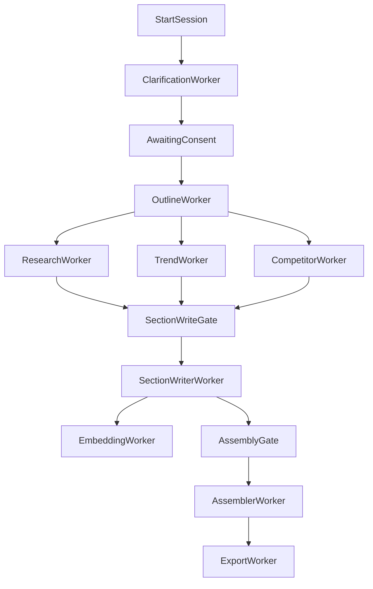

# Cross-Worker Integration and Acceptance Test Plan

Status: MVP integration plan

## Integration Flow

## Gate Conditions
- **Clarification gate**: `clarification_ready` and user consent accepted.
- **Research fan-out gate**: `outline_ready` emitted with valid sections.
- **Section writer gate**: required upstream completions received (`research_done`, `trend_ready`, `competitor_done`) or accepted degraded fallback policy.
- **Assembly gate**: all required `section_done` events complete.
- **Export gate**: `report_ready_for_export` emitted and draft persisted.

## Acceptance Matrix

| Level | Scenario | Expected Result |
|---|---|---|
| Worker | Clarification threshold reached | `clarification_ready` emitted once |
| Worker | Outline rerun | Sections replaced idempotently |
| Worker | Research dedupe | Duplicate URLs skipped |
| Worker | Trend extraction | `trend_ready` with count |
| Worker | Competitor extraction | `competitor_done` with count |
| Worker | Section writing | Chunk + citation rows persisted |
| Worker | Embedding batch | All chunk vectors persisted |
| Worker | Assembler complete | `report_ready_for_export` emitted |
| Worker | Export complete | artifact stored + metadata row |
| Orchestrator | Invalid state API call | deterministic `400` response |
| Orchestrator | Event replay | idempotency guards prevent duplicate transitions |
| E2E | Session to export | full pipeline reaches `export_done` |

## Required Test Suites
- Unit tests per worker service and parser/validator logic.
- Contract tests for event payload shape and mandatory keys.
- Orchestrator state-transition tests (happy + invalid-state).
- E2E synthetic test for complete session lifecycle.
- Failure-injection tests:
  - provider timeouts
  - malformed LLM output
  - partial DB write failures

## MVP Done Criteria
- Deterministic state transitions across core and planned workers.
- Completion events emitted for each stage with traceable `report_id`.
- Required artifacts persisted at each stage (sections, evidence, chunks, vectors, draft, export).
- Failure paths observable and recoverable via retries/fallback policy.

