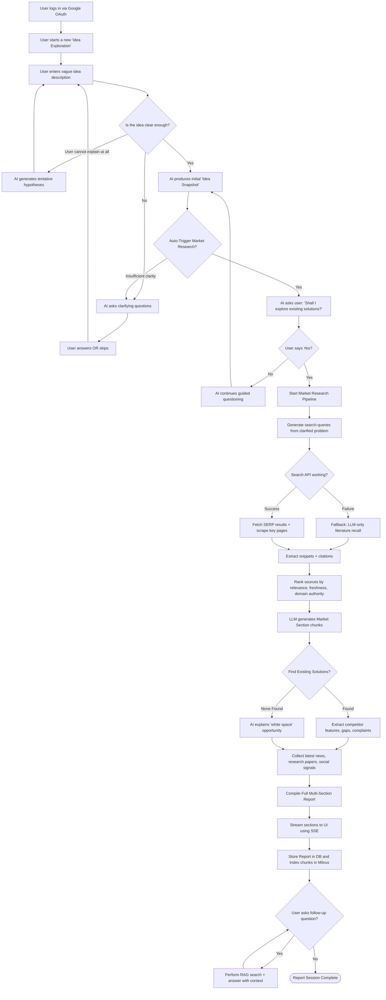

# Product LifeCycle

```mermaid
flowchart TD

%% Login + Start
A[User logs in via Google OAuth] --> B[User starts a new 'Idea Exploration']
B --> C[User enters vague idea description]

%% Clarification Loop
C --> D{Is the idea clear enough?}
D -- No --> E[AI asks clarifying questions]
E --> F[User answers OR skips]
F --> C

%% Edge Case: No clarity
D -- User cannot explain at all --> D1[AI generates tentative hypotheses]
D1 --> C

%% When Clear
D -- Yes --> G[AI produces initial 'Idea Snapshot']
G --> H{Auto-Trigger Market Research?}

%% System decides to suggest research
H -- Yes --> I[AI asks user: 'Shall I explore existing solutions?']

%% User Choices
I --> J{User says Yes?}
J -- No --> K[AI continues guided questioning]
K --> G

%% If Yes
J -- Yes --> L[Start Market Research Pipeline]

%% Edge case: Not enough clarity to research
H -- Insufficient clarity --> E

%% Research Steps
L --> M[Generate search queries from clarified problem]
M --> N{Search API working?}

%% Search failure
N -- Failure --> N1[Fallback: LLM-only literature recall]
N1 --> P[Collect top relevant references]

%% If search works
N -- Success --> O[Fetch SERP results + scrape key pages]
O --> P[Extract snippets + citations]

%% Relevance Ranking
P --> Q[Rank sources by relevance, freshness, domain authority]
Q --> R[LLM generates Market Section chunks]

%% Competitor Analysis
R --> S{Find Existing Solutions?}
S -- Found --> T[Extract competitor features, gaps, complaints]
S -- None Found --> T1[AI explains 'white space' opportunity]

%% Trend Scan
T --> U[Collect latest news, research papers, social signals]
T1 --> U

%% Final Report
U --> V[Compile Full Multi-Section Report]
V --> W[Stream sections to UI using SSE]
W --> X[Store Report in DB and Index chunks in Milvus]

%% Post-Report Deep Dive
X --> Y{User asks follow-up question?}
Y -- Yes --> Z[Perform RAG search + answer with context]
Z --> Y
Y -- No --> END([Report Session Complete])

```