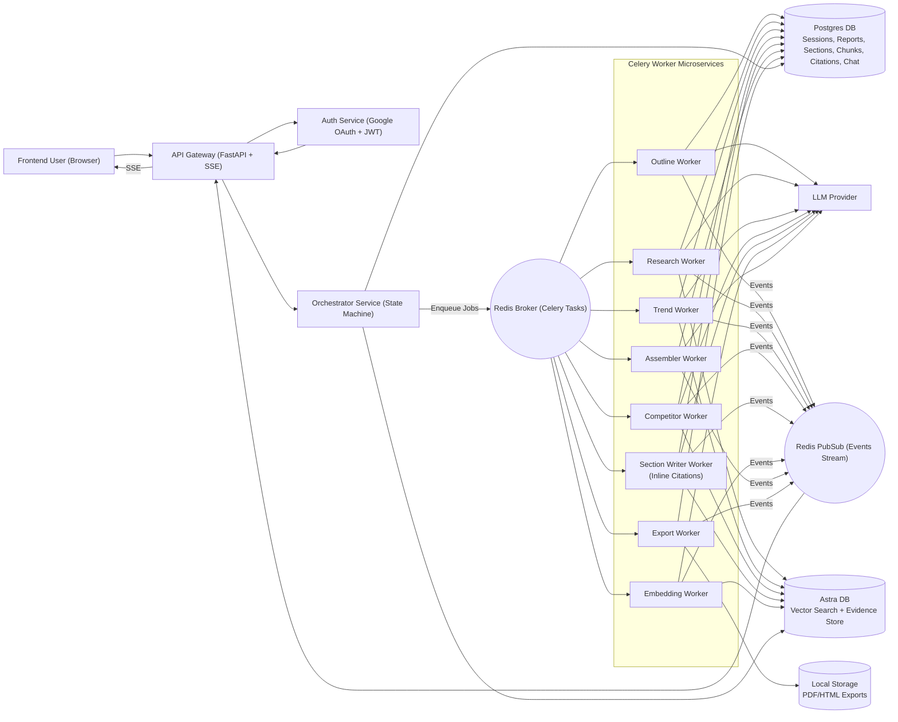
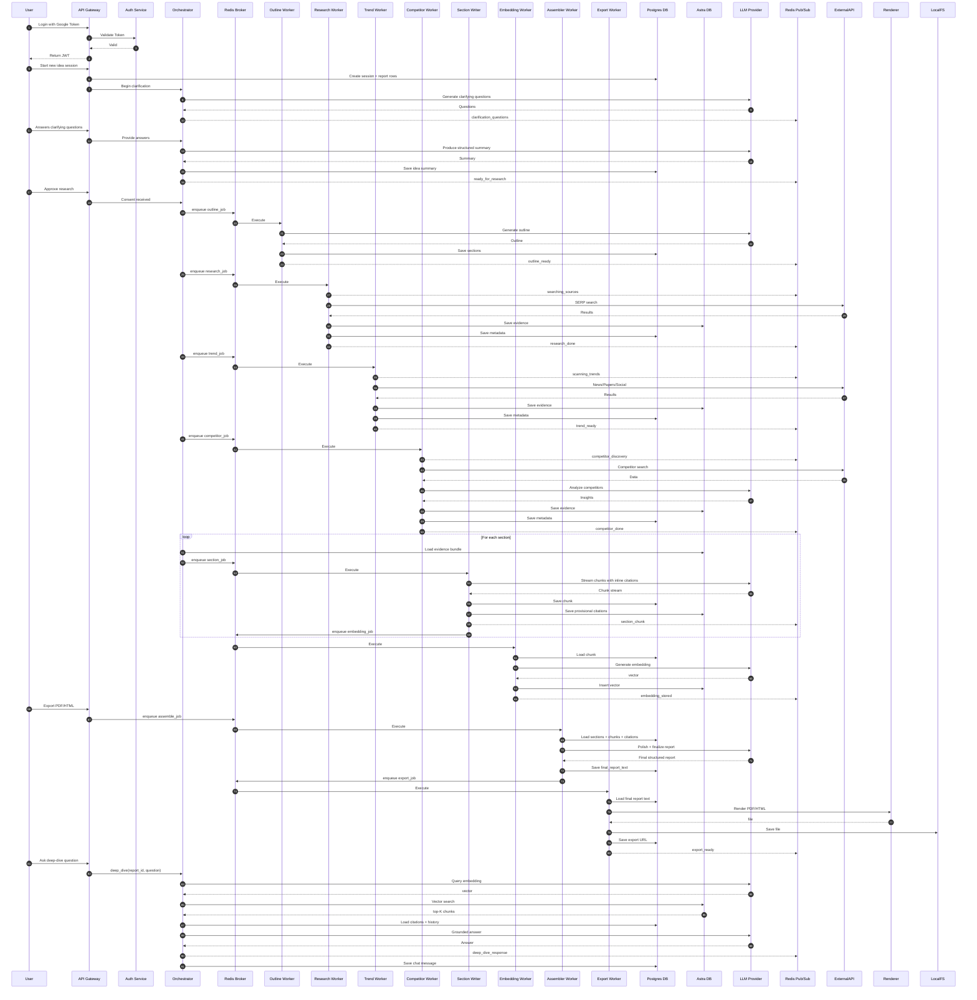

# System Design Brief



## Eraser Sequence Diagram

```mermaid
title End-to-End AI Report Generation
autoNumber nested

// Actor definitions with icons and colors
User [icon: user, color: blue]
API Gateway [icon: globe, color: green]
Auth Service [icon: lock, color: green]
Orchestrator [icon: cpu, color: purple]
Redis Broker [icon: database, color: orange]
Outline Worker [icon: file-text, color: orange]
Research Worker [icon: search, color: orange]
Trend Worker [icon: trending-up, color: orange]
Competitor Worker [icon: users, color: orange]
Section Writer [icon: edit, color: orange]
Embedding Worker [icon: hash, color: orange]
Assembler Worker [icon: layers, color: orange]
Export Worker [icon: download, color: orange]
Postgres DB [icon: database, color: teal]
Astra DB [icon: database, color: teal]
LLM Provider [icon: cpu, color: purple]
"Redis Pub/Sub" [icon: message-circle, color: orange]
External API [icon: cloud, color: gray]
Renderer [icon: image, color: pink]
LocalFS [icon: hard-drive, color: pink]

// User login flow
User > API Gateway: Login with Google token
API Gateway > Auth Service: Validate token
Auth Service --> API Gateway: Valid
API Gateway --> User: Return JWT

// Session start
User > API Gateway: Start new idea session
API Gateway > Postgres DB: Create session and report rows
API Gateway > Orchestrator: Begin clarification

// Idea clarification
Orchestrator > LLM Provider: Generate clarifying questions
LLM Provider --> Orchestrator: Questions
Orchestrator --> "Redis Pub/Sub": clarification_questions

User > API Gateway: Answer clarifying questions
API Gateway > Orchestrator: Provide answers
Orchestrator > LLM Provider: Produce structured summary
LLM Provider --> Orchestrator: Summary
Orchestrator > Postgres DB: Save idea summary
Orchestrator --> "Redis Pub/Sub": ready_for_research

// User consent
User > API Gateway: Approve research
API Gateway > Orchestrator: Consent received

// Outline generation
Orchestrator > Redis Broker: enqueue outline_job
Redis Broker > Outline Worker: Execute
Outline Worker > LLM Provider: Generate outline
LLM Provider --> Outline Worker: Outline
Outline Worker > Postgres DB: Save sections
Outline Worker --> "Redis Pub/Sub": outline_ready

// Market research
Orchestrator > Redis Broker: enqueue research_job
Redis Broker > Research Worker: Execute
Research Worker --> "Redis Pub/Sub": searching_sources
Research Worker > External API: SERP search
External API --> Research Worker: Results
Research Worker > Astra DB: Save evidence
Research Worker > Postgres DB: Save metadata
Research Worker --> "Redis Pub/Sub": research_done

// Trend scan
Orchestrator > Redis Broker: enqueue trend_job
Redis Broker > Trend Worker: Execute
Trend Worker --> "Redis Pub/Sub": scanning_trends
Trend Worker > External API: News/Papers/Social
External API --> Trend Worker: Results
Trend Worker > Astra DB: Save evidence
Trend Worker > Postgres DB: Save metadata
Trend Worker --> "Redis Pub/Sub": trend_ready

// Competitor analysis
Orchestrator > Redis Broker: enqueue competitor_job
Redis Broker > Competitor Worker: Execute
Competitor Worker --> "Redis Pub/Sub": competitor_discovery
Competitor Worker > External API: Competitor search
External API --> Competitor Worker: Data
Competitor Worker > LLM Provider: Analyze competitors
LLM Provider --> Competitor Worker: Insights
Competitor Worker > Astra DB: Save evidence
Competitor Worker > Postgres DB: Save metadata
Competitor Worker --> "Redis Pub/Sub": competitor_done

// Section writing (streaming)
loop [label: For each section, icon: repeat] {
  Orchestrator > Astra DB: Load evidence bundle
  Orchestrator > Redis Broker: enqueue section_job
  Redis Broker > Section Writer: Execute
  Section Writer > LLM Provider: Stream chunks with inline citations
  LLM Provider --> Section Writer: Chunk stream
  Section Writer > Postgres DB: Save chunk
  Section Writer > Astra DB: Save provisional citations
  Section Writer --> "Redis Pub/Sub": section_chunk
  Section Writer > Redis Broker: enqueue embedding_job
}

// Embeddings
Redis Broker > Embedding Worker: Execute
Embedding Worker > Postgres DB: Load chunk
Embedding Worker > LLM Provider: Generate embedding
LLM Provider --> Embedding Worker: vector
Embedding Worker > Astra DB: Insert vector
Embedding Worker --> "Redis Pub/Sub": embedding_stored

// Export request
User > API Gateway: Export PDF/HTML
API Gateway > Redis Broker: enqueue assemble_job

// Assembler
Redis Broker > Assembler Worker: Execute
Assembler Worker > Postgres DB: Load sections, chunks, citations
Assembler Worker > LLM Provider: Polish and finalize report
LLM Provider --> Assembler Worker: Final structured report
Assembler Worker > Postgres DB: Save final_report_text
Assembler Worker > Redis Broker: enqueue export_job

// Export worker
Redis Broker > Export Worker: Execute
Export Worker > Postgres DB: Load final report text
Export Worker > Renderer: Render PDF/HTML
Renderer --> Export Worker: file
Export Worker > LocalFS: Save file
Export Worker > Postgres DB: Save export URL
Export Worker --> "Redis Pub/Sub": export_ready

// Deep dive (after report)
User > API Gateway: Ask deep-dive question
API Gateway > Orchestrator: deep_dive(report_id, question)
Orchestrator > LLM Provider: Query embedding
LLM Provider --> Orchestrator: vector
Orchestrator > Astra DB: Vector search
Astra DB --> Orchestrator: top-K chunks
Orchestrator > Postgres DB: Load citations and history
Orchestrator > LLM Provider: Grounded answer
LLM Provider --> Orchestrator: Answer
Orchestrator --> "Redis Pub/Sub": deep_dive_response
Orchestrator > Postgres DB: Save chat message
```

## Mermaid Sequence diagram

