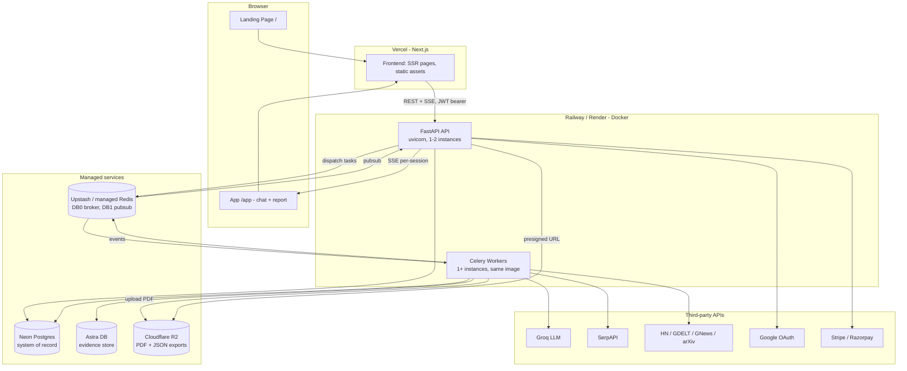

# 02 — Target Production Architecture

> This is the system we are building **toward**. Doc 01 describes where we are; docs 03–08 are the ordered steps to get here. Nothing in this doc requires exotic infrastructure — every piece has a free or cheap tier (costs in doc 06).

## 1. Design principles

1. **Keep the existing pipeline.** The Celery + Redis pub/sub worker pipeline works. We productionize it; we do not rewrite it.
2. **Managed services over self-hosting.** Neon/Supabase for Postgres, Upstash/managed Redis, Cloudflare R2 for files, Vercel for frontend, Railway/Render for backend. A one-person team should never SSH into a box at 3 AM.
3. **One repo, three deployables:** frontend (Next.js), API (FastAPI), workers (Celery). API and workers share the same Docker image with different start commands.
4. **The Integration Contract (doc 05) is law.** Both sides implement it exactly.

## 2. System diagram

## 3. Component specifications

### 3.1 Frontend (Vercel)

- **Routes:**
  - `/` — marketing landing page (hero, demo video/gif, pricing, FAQ, sign-in CTA). Static, SEO-optimized.
  - `/app` — the chat + report workspace (current `ChatShell`), auth-protected via middleware.
  - `/app/reports` — list of the user's past reports with re-download links.
  - `/login` — Google Sign-In button → backend `/auth/google` → JWT stored in httpOnly cookie (set via a Next.js route handler acting as a thin proxy).
  - `/billing` — plan display + Stripe/Razorpay checkout + usage meter.
- **State:** keep the `useReducer` store; persist `sessionId` + JWT so refresh resumes (rehydrate via `GET /orchestrate/status/{id}` + `GET /reports/{id}`).
- **SSE:** `EventSource` to `GET /stream/events/{session_id}?token=...` (session-scoped — see 3.2). Real reconnect with exponential backoff.
- **Rendering:** report sections rendered as Markdown (`react-markdown`), citations as superscript links, chunks **appended** during streaming.

### 3.2 API service (FastAPI on Railway/Render, Docker)

- **Auth:** `POST /auth/google` verifies Google ID token, **upserts a `User` row**, returns JWT (7-day expiry). Every `/orchestrate/*`, `/reports/*`, `/exports/*`, `/billing/*` route requires `Authorization: Bearer` via a FastAPI dependency; the dependency also enforces session ownership (`session.user_id == jwt.sub`).
- **Routes (final, single prefix):**

| Route | Purpose |
|---|---|
| `POST /auth/google` | Login/upsert, returns JWT |
| `POST /orchestrate/start-session` | JSON body `{idea_description}`; `user_id` from JWT |
| `POST /orchestrate/clarification/chat` | JSON body `{session_id, message}` |
| `POST /orchestrate/clarification/accept-consent` | JSON body `{session_id}` |
| `GET /orchestrate/status/{session_id}` | Full status incl. `report_id` |
| `GET /stream/events/{session_id}` | **Session-scoped** SSE (filter events by `session_id` in payload) |
| `GET /reports` | List current user's reports |
| `GET /reports/{report_id}` | Assembled report JSON (sections → chunks → citations) |
| `GET /exports/{report_id}/file` | 302 to a presigned R2 URL (or streams the file in dev) |
| `POST /billing/checkout` / `POST /billing/webhook` | Payment provider integration |
| `GET /healthz` | Liveness for the platform's health checks |

- **CORS:** allow only the frontend origin(s), configured by env var.
- **SSE scaling note:** the Redis listener thread stays in the API process for MVP (single API instance). If scaling beyond one instance, each instance subscribes to Redis independently — pub/sub fans out to all subscribers, so this works without change.

### 3.3 Worker service (Celery, same Docker image)

- Start command: `celery -A app.workers.celery_app worker --loglevel=info --concurrency=4`.
- Queues: single default queue for MVP. Post-launch, split `llm` (section writing) from `io` (research/trend) queues.
- **Pipeline changes vs today:**
  - Orchestrator gates section writing on **both** `research_done` and `trend_ready` (or a 90-second trend timeout so a dead feed can't hang the pipeline).
  - Export worker uploads the PDF to **R2** and stores the object key in `ExportRecord.file_url`.
  - All Redis/DB URLs from env vars.
- **Idempotency & retries:** existing Celery retries kept; every worker's first action is checking whether its output already exists (outline worker already does this — replicate the pattern).

### 3.4 Data stores

- **Neon Postgres** (or Supabase): system of record. Managed via **Alembic** migrations from day one of the production push. Add `plan`, `reports_used_this_month`, `stripe_customer_id` columns to `users`.
- **Redis (Upstash or Railway Redis):** DB 0 Celery, DB 1 pub/sub. Note: Upstash free tier does not support pub/sub well over REST — use a standard Redis instance (Railway plugin / Render Redis / Upstash with TCP) — see doc 06.
- **Astra DB:** unchanged (already fail-soft). Vector search activates post-launch when the embedding worker becomes real.
- **Cloudflare R2:** bucket `stratos-exports`, private; downloads via presigned URLs (1-hour expiry). S3-compatible API via `boto3`.

### 3.5 Eventing contract

All events published to Redis channel `stratos_events` as `{"type": str, "payload": {...}}`. **Every payload MUST include `session_id`** (this is what makes session-scoped SSE possible). The complete event list with payload shapes lives in doc 05 §4.

## 4. Environments

| Env | Frontend | API + workers | Data |
|---|---|---|---|
| **Local dev** | `next dev` on :3000 | `uvicorn` + `celery` on host, deps via `docker compose up` (postgres, redis) | Local containers; exports to local disk |
| **Production** | Vercel | Railway/Render (2 services, 1 image) | Neon, managed Redis, Astra, R2 |

A staging environment is intentionally omitted for MVP — one developer, deploy to prod behind a feature-freeze discipline. Add staging when there are >100 paying users.

## 5. Security model (MVP-appropriate)

1. JWT (HS256, strong `JWT_SECRET` from a password generator, never the `"supersecret"` default) in an httpOnly cookie; the Next.js server proxies it as a Bearer header, or the SPA holds it in memory + refresh via cookie.
2. Ownership checks on every session/report access.
3. Rate limiting: `slowapi` on `/orchestrate/start-session` (e.g. 5/hour/user) — this endpoint costs real money (SerpAPI + LLM) per call.
4. Plan quotas enforced in `start_session` (free: 2 reports/month; paid: per plan). See doc 08.
5. Secrets only in platform secret managers. `.env.example` committed with placeholder values.

## 6. Observability (minimum viable)

- **Sentry** (free tier) on both frontend and backend — captures worker exceptions too via Celery integration.
- Structured JSON logs (`python-json-logger`); Railway/Render retain logs natively.
- A `pipeline_runs` view or simple admin query: sessions stuck >15 min in a non-terminal state = alert (start with a daily manual check, automate later).

## 7. What is explicitly deferred (post-launch backlog)

- Competitor worker (real implementation), embedding worker + Deep Dive Q&A, LLM polish pass in assembler, multi-LLM provider routing, DLQ + admin replay UI, staging environment, SOC2-style hardening, team/workspace features.
